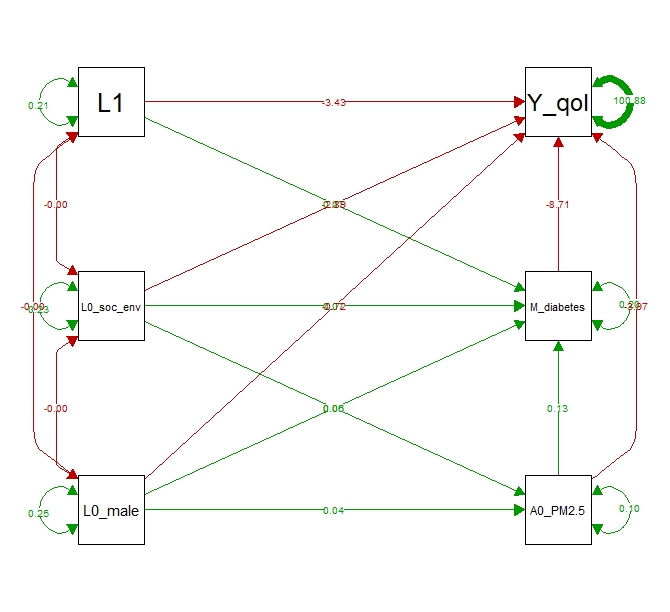

# Baron and Kenny, structural equation models {#ChapBaronKennySem}

The Baron and Kenny approach can be applied if we make the assumption that no confounder of the $M \rightarrow Y$ relationship is affected by the exposure $A$. As a consequence we will use the `df1.csv` data set simulated from the Causal model 1 (Figure \@ref(fig:figDAGM1)). We will also assume that there is no $A \ast M$ interaction effect on the outcome $Y$ in the following examples. Such interaction effects can be dealt with using traditional regression models in very similar approaches described in chapter \@ref(ChapTradRegModels).

## Baron and Kenny approach

The Baron & Kenny approach relies on sequential and step-wise estimation of linear regression models:

  - A model for the total effect of the exposure $A$ on the outcome $Y$ (conditional on baseline confounders $L(0)$)
  
  \begin{equation*}
    \mathbb{E}(Y \mid A,L(0)) = \theta_0 + \theta_A A + \theta_{L(0)} L(0)
  \end{equation*}
  
  - A model to test if the exposure $A$ has an effect on the mediator $M$ (conditional on baseline confounders $L(0)$ of the $A-M$ relationship)
  
  \begin{equation*}
    \mathbb{E}(M \mid A,L(0)) = \beta_0 + \beta_A A + \beta_{L(0)} L(0)
  \end{equation*}
  
  - A model to estimate the direct effect of the exposure $A$ on the outcome $Y$ as well as the effect of the mediator $M$ on the outcome, adjusted for baseline confounders $L(0)$ and confounders of the $M-Y$ relationship $L(1)$
  
  \begin{equation*}
    \mathbb{E}(Y \mid A,M,L(1),L(0)) = \gamma_0 + \gamma_A A + \gamma_M M + \gamma_{L(0)} L(0) + \gamma_{L(1)} L(1)
  \end{equation*}

The total effect is given by the $\theta_A$ coefficient from the 1st model.

The direct effect is given by the $\gamma_A$ coefficient from the 3rd model.

The indirect effect can be calculated using: 

  - the "difference in coefficient" method based on the 1st and 3rd models: $\theta_A - \gamma_A$,
  - or the "product of coefficient" method based on the 2nd and 3rd models: $\beta_A \times \gamma_M$.

```{r Baron_and_Kenny, echo=TRUE, eval = FALSE}
## Import data 
rm(list=ls())
df1 <- read.csv(file = "./data/df1.csv")

## Model 1 to estimate the total effect:
model.tot.A.QoL <- lm(Y_qol ~ A0_PM2.5 + L0_male + L0_soc_env,
                      data = df1)
summary(model.tot.A.QoL)
# Coefficients:
#               Estimate Std. Error t value Pr(>|t|)
#   (Intercept)  71.8820     0.2155 333.565  < 2e-16 ***
#   A0_PM2.5     -5.0961     0.3486 -14.617  < 2e-16 *** <- Total effect
#   L0_male      -1.1486     0.2194  -5.235 1.68e-07 ***
#   L0_soc_env   -3.4441     0.2295 -15.005  < 2e-16 ***

# The total effect of being exposed to high levels of PM_2.5 on Quality of life
# is approximately equal to an average decrease of -5.1 on the QoL scale,
# given by the A0_PM2.5 coefficient:
model.tot.A.QoL$coefficients["A0_PM2.5"]
# -5.096057

## Model 2 to estimate the effect of the exposure on the mediator
## because the mediator is binary, we might want to use a logistic or probit regression
## for example
logit.model.A.M <- glm(M_diabetes ~ A0_PM2.5 + L0_male + L0_soc_env,
                       data = df1, family = "binomial")
summary(logit.model.A.M)
# effects estimated on the logit scale:
# Coefficients:
#                          Estimate Std. Error z value Pr(>|z|)
#   (Intercept) -1.27152    0.04584 -27.736  < 2e-16 ***
#   A0_PM2.5     0.56168    0.06537   8.592  < 2e-16 *** <- effect of A on M
#   L0_male      0.25455    0.04425   5.753 8.77e-09 ***
#   L0_soc_env   0.32683    0.04731   6.908 4.91e-12 ***
exp(coefficients(logit.model.A.M)["A0_PM2.5"])
# Odds ratio = 1.753609  for the effect of being exposed to high levels of PM_2.5
# on the mediator (probability of type 2 diabetes)

## Model 3 to estimate the direct effect of the exposure (conditional on the outcome) and
## the effect of M on Y, adjusted for confounders of the A-Y and M-Y relationships
model.A.M.QoL <- lm(Y_qol ~ A0_PM2.5 + M_diabetes + L1 + L0_male + L0_soc_env,
                    data = df1)
summary(model.A.M.QoL)
# Coefficients:
#               Estimate Std. Error t value Pr(>|t|)
#   (Intercept)  74.7858     0.2130 351.178  < 2e-16 ***
#   A0_PM2.5     -3.9650     0.3212 -12.345  < 2e-16 *** <- Direct effect
#   M_diabetes   -8.7138     0.2221 -39.237  < 2e-16 *** <- effect of M on Y
#   L1           -3.4252     0.2212 -15.483  < 2e-16 ***
#   L0_male      -0.7193     0.2017  -3.566 0.000364 ***
#   L0_soc_env   -2.8876     0.2112 -13.674  < 2e-16 ***

# The direct effect of PM_2.5 is approximately -4.0 given by the A0_PM2.5 coefficient
model.A.M.QoL$coefficients["A0_PM2.5"]
# -3.965038

## Following the Baron & Kenny Steps, we would conclude that :
# - There is a significant total effect of PM_2.5 on Quality of Life (Model 1)
# - There is a significant effect of PM_2.5 on the mediator (diabetes) (Model 2)
# - There is a significant effect of the mediator (diabetes) on Qol (model 3)
# - The direct effect is significantly non-null
# => Conclusion: Diabetes partially mediates the relationship between PM_2.5 and QoL

### Estimation of the indirect effect:
### We can apply the difference in coefficient method to estimate the indirect effect:
### substract the direct effect from the Total effect:
ind.effect.dif.meth <- (model.tot.A.QoL$coefficients["A0_PM2.5"] -
                          model.A.M.QoL$coefficients["A0_PM2.5"])
# -1.131019
# the indirect effect is approximately -1.1
# The confidence interval of the indirect effect can be computed by bootstrap.

# Because the mediator is binary and we applied a logistic regression for Model 2,
# we cannot apply the product of coefficients combining a coefficient from
# Model 2 (logit scale) and from Model 3 (difference scale)

### Model 2bis
# Surprisingly, another possibility is to run a linear model of the binary mediator
# instead of the logistic regression to apply the "product of coefficient method"
# in order to estimate the indirect effect:
linear.model.A.M <- lm(M_diabetes ~ A0_PM2.5 + L0_male + L0_soc_env,
                       data = df1)
summary(linear.model.A.M)
# Coefficients:
#             Estimate Std. Error t value Pr(>|t|)
# (Intercept) 0.215398   0.008929  24.123  < 2e-16 ***
# A0_PM2.5    0.127180   0.014446   8.804  < 2e-16 *** <- effect of A on M
# L0_male     0.052363   0.009091   5.760 8.67e-09 ***
# L0_soc_env  0.065806   0.009511   6.919 4.83e-12 ***

## product of coefficient method:
ind.effect.prod.meth <- (linear.model.A.M$coefficients["A0_PM2.5"] *
                           model.A.M.QoL$coefficients["M_diabetes"])
# -1.108213
# which also gives an indirect effect of approximately -1.1
```

The Baron & Kenny approach is usually applied for continuous outcomes, using linear regressions. It is less adapted for binary outcomes.

However, as for the binary mediator, some authors suggested that using linear regressions of the mediator and the outcome could still give some results.

```{r Baron_and_Kenny_binary, echo=TRUE, eval = FALSE}
### Baron & Kenny approach for binary outcomes:
## Model 1: linear model of the probability of death to estimate the total effect:
model.tot.A.death <- lm(Y_death ~ A0_PM2.5 + L0_male + L0_soc_env,
                        data = df1)
summary(model.tot.A.death)
# Coefficients:
#               Estimate Std. Error t value Pr(>|t|)
#   (Intercept) 0.135282   0.007909  17.104  < 2e-16 ***
#   A0_PM2.5    0.060247   0.012796   4.708 2.53e-06 *** <- Total effect
#   L0_male     0.050285   0.008053   6.244 4.43e-10 ***
#   L0_soc_env  0.059565   0.008425   7.070 1.65e-12 ***
# On a risk difference scale the total effect of being exposed to high levels of
# PM_2.5 on the probability of death is approximately +6.0%

## Model 3: linear model to estimate the direct effect of the exposure (conditional on
## the outcome) and the effect of M on Y, adjusted for confounders of the A-Y
## and M-Y relationships
model.A.M.death <- lm(Y_death ~ A0_PM2.5 + M_diabetes + L1 + L0_male + L0_soc_env,
                      data = df1)
summary(model.A.M.death)
#   Coefficients:
#                          Estimate Std. Error t value Pr(>|t|)
#   (Intercept) 0.098691   0.008460  11.666  < 2e-16 ***
#   A0_PM2.5    0.051509   0.012759   4.037 5.45e-05 *** <- Direct effect
#   M_diabetes  0.064751   0.008822   7.340 2.31e-13 *** <- effect of M on Y
#   L1          0.075533   0.008788   8.595  < 2e-16 ***
#   L0_male     0.047490   0.008013   5.927 3.19e-09 ***
#   L0_soc_env  0.055676   0.008389   6.637 3.36e-11 ***


# The direct effect is approximately +5.2% given by the A0_PM2.5 coefficient
model.A.M.death$coefficients["A0_PM2.5"]
# 0.05150901

# The indirect effect can be calculated by the "difference in coefficient" method
# using coefficients from models 1 and 3
model.tot.A.death$coefficients["A0_PM2.5"] - model.A.M.death$coefficients["A0_PM2.5"]
# 0.008737889, i.e. approximately 0.9%

# or the product of coefficients using the previous model 2bis and model 3:
linear.model.A.M$coefficients["A0_PM2.5"] * model.A.M.death$coefficients["M_diabetes"]
# 0.008234978, i.e. approximately 0.8%
```


## Path analysis and Structural Equation Modeling
### First application, without intermediate confouding affected by the exposure
Path analyses can be considered as a "generalization" of the product of coefficients method. They combine graphical representation of causal structures, a set of linear equations and assumptions concerning the covariance structure of residuals.

When the causal model includes latent variables (represented by a measurement model), we refer to the analysis as structural equation modeling.

Variables which does not receive causal inputs from any other variable in the diagram are called exogenous variables. Unless the assumption is explicitly made that two exogenous variables are uncorrelated (because they do not have any common causal factor), it is preferable to consider them as not independent (connecting them by double arrows).

In the `df1.csv` data set, there are 3 exogenous variables: `L0_male`, `L0_soc_env` and `L1`.

We will use the [`lavaan`](https://lavaan.ugent.be/) R package to run path analyses.

  - The first step is to write the model syntax
  - The second step is to analyze the model with the dataset
  
For a complete overview of the analyses that can be performed using `lavaan`, you can read:

  - [the lavaan tutorial](https://lavaan.ugent.be/tutorial/)
  - [A lavaan Compendium for Structural Equation Modeling in Educational Research](https://tdjorgensen.github.io/SEM-in-Ed-compendium/index.html),[@Jak2023]
  - [R Cookbook for Structural Equation Modeling](https://gabriellajg.github.io/EPSY-579-R-Cookbook-for-SEM/),[@Jiang2023]
  
**First step**. Let us write the model syntax to analyze the effect of being exposed to high levels of $\text{PM}_{2.5}$ on quality of life, mediated by type-2 diabetes.

We have to define:

  - regression models for the endogenous variables: exposure to $\text{PM}_{2.5}$ (`A0_PM2.5`), type-2 diabetes (`M_diabetes`) and quality of life (`Y_qol`)
  - covariance assumptions for the exogenous variables
  - we can also define additional parameters of interest (in our case, direct, indirect and total effects)
  
  
```{r sem_model_qol, echo=TRUE, eval = FALSE}
sem.QoL <- "                                 # models are written between quotes
## Regression models
## we can also add the names of some path coefficients 
  A0_PM2.5 ~ L0_male + L0_soc_env
  M_diabetes ~ L0_male + L0_soc_env + b.A * A0_PM2.5 + L1   # label b.A path coef
  Y_qol ~ L0_male + L0_soc_env + c.A*A0_PM2.5 + L1 + c.M*M_diabetes # label c.A and c.M

## Covariances
# Assuming a non-null covariance between confounders 
# covariances are represented with a double tilde ~~ (double arrow)
# (note: in the data-generating system, the null assumptions were true)
  L0_male ~~ L0_soc_env
  L0_male ~~ L1
  L0_soc_env ~~ L1

## We can define other parameters to estimate, using the := syntax
## we want the direct, indirect and total effects:
  direct := c.A
  indirect := b.A * c.M
  total := (b.A * c.M) + c.A
"
```

**Second step**. Let us analyze the model with the `df1.csv` dataset using the `sem` function from the `lavaan` package.

Binary exogenous variables (`L0_male`,`L0_soc_env` and `L1`) can be coded as simple dummy (0/1) variables, there is no need to declare them as factors (`ordered`). 

Note that in the following example, we will not declare the other binary variables (`A0_PM2.5`,`M_diabetes`) as factors and let them as simple dummy variables.

Running the `sem` function with the `df1.csv` dataset, we obtain: 

  - information about the estimator
  - estimates of the regression models
  - estimates of the covariance between exogenous variables
  - estimates of the residual variances
  - estimates of the additional parameters (direct, indirect and total effects)
  
For datasets with only continuous variables, `lavaan` would estimate the covariance structure by maximum likelihood estimation. For categorical data, weighted least square estimators (WLS) are typically used. Applying WLS to continuous data is referred to as asymptotical distribution-free estimation (ADF) in the SEM literature. ADF estimation requires large sample sizes (> 2000 or 5000).[@Jak2023]

In order to avoid underestimating standard errors and confidence intervals, robust estimators ("sandwich" and bootstrap) are usually applied if the data are not multivariate normal.

```{r sem_analysis_qol1, echo=TRUE, eval = FALSE}
set.seed(1234)
fit.qol <- lavaan::sem(model = sem.QoL,
                       fixed.x = FALSE, # ask for covariance of exogenous variables
                                        # to be freely estimated 
                       # estimator = "DWLS",  # for WLS estimation
                       se = "boot", # estimation of SE by bootstrap
                       # se = "robust.sem", # for sandwich-type SE
                       bootstrap = 100, # better with 1000 bootstrap samples or more
                       data = df1)
summary(fit.qol,
        ci = TRUE) # add 95%CI in the output
# You will get 2 warning messages: 
# 1) we did not standardize the outcome, its variance is very large variance compared  
#    to the other binary variables (not a problem)
# 2) 3 bootstrap runs failed or did not converge. 
#    => The estimations relie on the 97 other bootstrap samples

# lavaan 0.6-18 ended normally after 23 iterations
#
#   Estimator                                         ML
#   Optimization method                           NLMINB
#   Number of model parameters                        20
#
#   Number of observations                         10000
#
# Model Test User Model:
#   Test statistic                                 0.211
#   Degrees of freedom                                 1
#   P-value (Chi-square)                           0.646
#
# Parameter Estimates:
#   Standard errors                            Bootstrap
#   Number of requested bootstrap draws              100
#   Number of successful bootstrap draws              97
#
# Regressions:
#                  Estimate  Std.Err  z-value  P(>|z|) ci.lower ci.upper
# A0_PM2.5 ~
#   L0_male           0.040    0.005    7.310    0.000    0.029    0.050
#   L0_sc_nv          0.058    0.006    9.243    0.000    0.046    0.071
# M_diabetes ~
#   L0_male           0.053    0.009    5.626    0.000    0.033    0.074
#   L0_sc_nv          0.066    0.010    6.948    0.000    0.047    0.088
#   A0_PM2.5 (b.A)    0.127    0.015    8.475    0.000    0.100    0.156
#   L1                0.070    0.011    6.391    0.000    0.046    0.088
# Y_qol ~
#   L0_male          -0.719    0.190   -3.777    0.000   -1.081   -0.314
#   L0_sc_nv         -2.888    0.210  -13.760    0.000   -3.262   -2.408
#   A0_PM2.5 (c.A)   -3.965    0.331  -11.977    0.000   -4.631   -3.262
#   L1               -3.425    0.189  -18.136    0.000   -3.808   -3.043
#   M_diabts (c.M)   -8.714    0.211  -41.394    0.000   -9.082   -8.280
#
# Covariances:
#                  Estimate  Std.Err  z-value  P(>|z|) ci.lower ci.upper
# L0_male ~~
#   L0_soc_env       -0.003    0.003   -1.055    0.291   -0.008    0.004
#   L1               -0.002    0.002   -0.887    0.375   -0.006    0.002
# L0_soc_env ~~
#   L1               -0.001    0.002   -0.452    0.651   -0.006    0.003
#
# Variances:
#                  Estimate  Std.Err  z-value  P(>|z|) ci.lower ci.upper
#  .A0_PM2.5          0.099    0.002   43.273    0.000    0.094    0.103
#  .M_diabetes        0.205    0.002  114.604    0.000    0.200    0.208
#  .Y_qol           100.882    1.409   71.573    0.000   98.185  103.725
#   L0_male           0.250    0.000 9358.475    0.000    0.250    0.250
#   L0_soc_env        0.229    0.001  166.244    0.000    0.226    0.232
#   L1                0.207    0.002  117.109    0.000    0.204    0.210
#
# Defined Parameters:
#                Estimate  Std.Err  z-value  P(>|z|) ci.lower ci.upper
# direct           -3.965    0.333  -11.915    0.000   -4.631   -3.262
# indirect         -1.104    0.129   -8.586    0.000   -1.359   -0.866
# total            -5.069    0.358  -14.170    0.000   -5.843   -4.343

# ?lavaan::parameterEstimates for more options on bootstrap SE estimations.
parameterEstimates(fit.qol,
                   level = 0.95,
                   boot.ci.type = "bca.simple") # "bca.simple" to correct for bias,
                                                # but not acceleration
#           lhs op           rhs    label     est    se        z pvalue ci.lower ci.upper
# 1    A0_PM2.5  ~       L0_male            0.040 0.005    7.310  0.000    0.031    0.051
# 2    A0_PM2.5  ~    L0_soc_env            0.058 0.006    9.243  0.000    0.045    0.070
# ...
# 21     direct :=           c.A   direct  -3.965 0.333  -11.915  0.000   -4.544   -3.190
# 22   indirect :=       b.A*c.M indirect  -1.104 0.129   -8.586  0.000   -1.401   -0.897
# 23      total := (b.A*c.M)+c.A    total  -5.069 0.358  -14.170  0.000   -5.658   -4.201
```
We recall that the results obtained using Baron & Kenny approach were:

  - direct effect = -3.965
  - indirect effect = -1.131 (using the "difference in coefficients" method) or -1.108213 (using the "product of coefficients" method)
  - total effect = -5.096
  
The path analysis results from `lavaan` are very close to the Baron & Kenny results.

We can plot the estimated model using the `semPlot` package (Figure \@ref(fig:FigSemPlotQol1)):
```{r sem_plot_qol1, echo=TRUE, eval = FALSE}
library(semPlot)
semPaths(fit.qol,
         what = "est",
         layout = "tree2", # tree, tree2, spring
         rotation = 2, #exogenous on the left, endogenous on the right
         sizeMan = 10, # font size of manifest variable names
         nCharNodes = 0,
         nCharEdges = 0, # don't limit variable name lengths
         edge.label.cex = 0.6,
         curvePivot = TRUE,
         fade = FALSE)
```

```{r FigSemPlotQol1, echo=FALSE, out.width="70%", fig.align="center", fig.cap="Plot of the SEM"}
    
```


### Dealing with categorical endogenous variables
In the dataset, we can declare the binary endogenous variables as `ordered` variables, so that the `sem` function will detect them automatically as categorical variables, and apply a Weighted Least Square estimation.

When endogenous variables are binary or ordered categorical variables, the SEM-method will assume the existence of latent normal variables that underlies the observed categorical variables (corresponding to _latent response variables_ (LRV)). SEM will then fit the model to the LRV instead of the categorical variables. The distribution of a categorical variable is linked to the LRV using "thresholds", defined from the cumulative distribution function of a standard normal distribution to match the probabilities of observed levels (similarly to probit regressions).[@Jak2023]

```{r sem_analysis_qol2, echo=TRUE, eval = FALSE}
## We first create a data.frame, setting the exposure and mediator to ordered variables
df1.cat <- data.frame(L0_male = df1$L0_male,
                      L0_soc_env = df1$L0_soc_env,
                      A0_PM2.5 = ordered(df1$A0_PM2.5), 
                      L1 = df1$L1,
                      M_diabetes = ordered(df1$M_diabetes), 
                      Y_qol = df1$Y_qol)

## We analyze the model with the new data.frame (df1.cat)
## In this example, we estimate standwich-type standard errors
fit.qol <- lavaan::sem(model = sem.QoL,
                       se = "robust.sem", # for sandwich-type SE
                       fixed.x = FALSE,
                       data = df1.cat)
# You will get 2 warnings:
# 1) A generalized inverse for A11 submatrix was used to solve a trouble
#    constructing W matrix
# 2) The variance-covariance matrix of the vcov does not appear to be positive definite.
#    Probably because the mean and variance of binary variable are collinear.
#    This message might be quite common and can be ignored
summary(fit.qol,
        ci = TRUE)
# lavaan 0.6-18 ended normally after 76 iterations
#
# Estimator                                       DWLS  # apply WLS estimator
# Optimization method                           NLMINB
# Number of model parameters                        24
#
# Number of observations                         10000
#
# Model Test User Model:
#   Standard      Scaled
# Test Statistic                                 0.209       0.214
# Degrees of freedom                                 1           1
# P-value (Chi-square)                           0.648       0.644
# Scaling correction factor                                  0.977
# Shift parameter                                           -0.000
# simple second-order correction
#
# Parameter Estimates:
#   Parameterization                               Delta
#   Standard errors                           Robust.sem
#   Information                                 Expected
#   Information saturated (h1) model        Unstructured
#
# Regressions:
#                  Estimate  Std.Err  z-value   P(>|z|) ci.lower ci.upper
# A0_PM2.5 ~
#   L0_male           0.209    0.033     6.394    0.000    0.145    0.273
#   L0_sc_nv          0.324    0.035     9.129    0.000    0.254    0.393
# M_diabetes ~
#   L0_male           0.129    0.027     4.846    0.000    0.077    0.181
#   L0_sc_nv          0.156    0.029     5.463    0.000    0.100    0.212
#   A0_PM2.5 (b.A)    0.182    0.021     8.498    0.000    0.140    0.224
#   L1                0.199    0.028     7.083    0.000    0.144    0.254
# Y_qol ~
#   L0_male          -0.193    0.214    -0.899    0.369   -0.613    0.227
#   L0_sc_nv         -2.130    0.232    -9.195    0.000   -2.585   -1.676
#   A0_PM2.5 (c.A)   -1.754    0.169   -10.351    0.000   -2.086   -1.422
#   L1               -3.070    0.229   -13.411    0.000   -3.519   -2.621
#   M_diabts (c.M)   -4.927    0.142   -34.802    0.000   -5.204   -4.649
#
# Covariances:
#   Estimate  Std.Err  z-value   P(>|z|) ci.lower ci.upper
# L0_male ~~
#   L0_soc_env       -0.003    0.002    -1.167    0.243   -0.007    0.002
#   L1               -0.002    0.002    -0.801    0.423   -0.006    0.003
# L0_soc_env ~~
#   L1               -0.001    0.002    -0.425    0.671   -0.005    0.003
#
# Intercepts:
#                  Estimate  Std.Err  z-value   P(>|z|) ci.lower ci.upper
#  .Y_qol            72.816    0.228   319.590    0.000   72.370   73.263
#   L0_male           0.501    0.005   100.197    0.000    0.491    0.511
#   L0_soc_env        0.644    0.003   187.422    0.000    0.637    0.651
#   L1                0.293    0.002   128.425    0.000    0.289    0.298
#
# Thresholds:
#                Estimate  Std.Err  z-value   P(>|z|) ci.lower ci.upper
# A0_PM2.5|t1       1.527    0.031    48.583    0.000    1.465    1.589
# M_diabetes|t1     0.810    0.026    30.789    0.000    0.758    0.861
#
# Variances:
#                  Estimate  Std.Err  z-value   P(>|z|) ci.lower ci.upper
#  .A0_PM2.5          0.965                                0.965    0.965
#  .M_diabetes        0.975                                0.975    0.975
#  .Y_qol            88.521    1.538    57.551    0.000   85.506   91.535
#   L0_male           0.250    0.000 12499.500    0.000    0.250    0.250
#   L0_soc_env        0.229    0.002   106.346    0.000    0.225    0.234
#   L1                0.207    0.002    91.060    0.000    0.203    0.212
#
# Defined Parameters:
#                Estimate  Std.Err  z-value   P(>|z|) ci.lower ci.upper
# direct           -1.754    0.169   -10.351    0.000   -2.086   -1.422
# indirect         -0.896    0.099    -9.041    0.000   -1.091   -0.702
# total            -2.651    0.177   -14.942    0.000   -2.998   -2.303
```
The results of the direct, indirect and total effects are quite different from the Baron & Kenny estimations and the previous SEM (where categorical exogenous variables were treated as simple dummy variables).

This difference can probably be explained by the fact that the data generating system (used to simulate the data) does not imply latent normal variables underlying the categorical variables. Binary variables were directly simulated using binomial distributions.

If the exposure, mediator and outcome variables are a mix of continuous and categorical variables, [@Iacobucci2008] recommends to treat them as simple dummy variables (and as continuous variables when fitting the models).


### Application with intermediate confounding affected by the exposure
Under the causal model where the intermediate confounder $L(1)$ of the $M-Y$ relationship is affected by the exposure $A$ (Causal model 2, Figure \@ref(fig:figDAGM2)), we can describe 4 directed paths connecting the exposure to the outcome : 

  (i) the path $A \rightarrow Y$,
  (ii) the path $A \rightarrow L(1) \rightarrow Y$
  (iii) the path $A \rightarrow M \rightarrow Y$
  (iv) and the path $A \rightarrow L(1) \rightarrow M \rightarrow Y$

In the causal inference literature, 

  - the _Marginal Randomized (or Interventional) Indirect Effect_ (MRIE), described by [@vanderweele2016], can be considered as an analogue of the set of directed paths from $A$ to $Y$ going through the mediator $M$ (i.e. paths (iii) $A \rightarrow M \rightarrow Y$ and (iv) $A \rightarrow L(1) \rightarrow M \rightarrow Y$)
  - and the _Marginal Randomized (or Interventional) Direct Effect_ (MRDE), corresponds to the other paths (i.e. paths (i) $A \rightarrow Y$ and (ii) $A \rightarrow L(1) \rightarrow Y$).
  
Regarding the _conditional effects_ described by [@zheng2017longitudinal], 

  - the _Conditional Randomized (or Interventional) Indirect Effect_ (CRIE), described by [@vanderweele2016,@lin2017], can be considered as an analogue of the specific paths from $A$ to $Y$ going only through the mediator $M$ (i.e. path (iii) $A \rightarrow M \rightarrow Y$)
  - and the _Conditional Randomized (or Interventional) Direct Effect_ (CRDE), corresponds to the other paths (i.e. paths (i) $A \rightarrow Y$ and (ii) $A \rightarrow L(1) \rightarrow Y$ and (iv) $A \rightarrow L(1) \rightarrow M \rightarrow Y$).

We can estimate the 4 paths by SEM analysis. Using the `df2.csv` dataset (without $A\ast M$ interaction effect on the outcome), we will explore the effect of the exposure to high levels of $\text{PM}_{2.5}$ on quality of life ($Y$), through type-2 diabetes (mediator of interest $M$), where overweight $L(1)$ is affected by the exposure.

```{r sem_analysis_qol3, echo=TRUE, eval = FALSE}
df2 <- read.csv(file = "data/df2.csv")
head(df2)
#   L0_male L0_soc_env A0_PM2.5 L1 M_diabetes Y_death    Y_qol
# 1       0          1        0  1          0       0 91.91819
# 2       1          1        1  0          0       1 67.53221
# 3       1          1        0  0          0       0 75.56249
# 4       1          0        0  0          0       0 89.77055
# 5       1          1        0  1          1       1 63.22353
# 6       1          1        0  1          0       0 77.87975

## quality of life ----
## First step: write the model syntax
sem.QoL.df2 <- "
  ## SEM for quantitative outcome (QoL)
  # Regression models
    A0_PM2.5 ~ a.L01 * L0_male + a.L02 * L0_soc_env
    L1 ~ b.L01 * L0_male + b.L02 * L0_soc_env + b.A * A0_PM2.5
    M_diabetes ~ c.L01 * L0_male + c.L02 * L0_soc_env + c.A * A0_PM2.5 + c.L1 * L1
    Y_qol ~ d.01 * L0_male + d.02 * L0_soc_env + d.A * A0_PM2.5 + d.L1 * L1 + d.M * M_diabetes

  # Assuming the possibility of non-null covariance between confounders
  # (note: in the data-generating system, the null assumptions were true)
    L0_male ~~ L0_soc_env

  # define other parameters: specific paths, direct, indirect and total effects
    path.A_Y := d.A
    path.A_L1_Y := b.A * d.L1
    path.A_M_Y := c.A * d.M
    path.A_L1_M_Y := b.A * c.L1 * d.M
    MRDE := d.A + (b.A * d.L1)
    MRIE := (c.A * d.M) + (b.A * c.L1 * d.M)
    CRDE := d.A + (b.A * d.L1) + (b.A * c.L1 * d.M)
    CRIE := (c.A * d.M)
    total := d.A + (b.A * d.L1) + (c.A * d.M) + (b.A * c.L1 * d.M)
  "

## Second step: estimate the model with the df2 dataset
fit.qol.df2 <- lavaan::sem(model = sem.QoL.df2,
                           se = "robust.sem", # for sandwich-type SE
                           fixed.x = FALSE,
                           data = df2)
summary(fit.qol.df2,
        ci = TRUE)
# lavaan 0.6-18 ended normally after 18 iterations
#
# Estimator                                         ML
# Optimization method                           NLMINB
# Number of model parameters                        21
#
# Number of observations                         10000
#
# Model Test User Model:
#   Test statistic                                 0.000
#   Degrees of freedom                                 0
#
# Parameter Estimates:
#   Standard errors                           Robust.sem
#   Information                                 Expected
#   Information saturated (h1) model          Structured
#
# Regressions:
#                  Estimate  Std.Err  z-value   P(>|z|) ci.lower ci.upper
# A0_PM2.5 ~
#   L0_mal (a.L01)    0.040    0.006     6.339    0.000    0.027    0.052
#   L0_sc_ (a.L02)    0.058    0.006     9.527    0.000    0.046    0.070
# L1 ~
#   L0_mal (b.L01)   -0.043    0.009    -4.638    0.000   -0.062   -0.025
#   L0_sc_ (b.L02)    0.069    0.010     7.166    0.000    0.050    0.088
#   A0_PM2   (b.A)    0.226    0.016    14.373    0.000    0.195    0.257
# M_diabetes ~
#   L0_mal (c.L01)    0.052    0.009     5.662    0.000    0.034    0.070
#   L0_sc_ (c.L02)    0.064    0.010     6.692    0.000    0.045    0.082
#   A0_PM2   (c.A)    0.072    0.016     4.567    0.000    0.041    0.103
#   L1      (c.L1)    0.194    0.010    18.962    0.000    0.174    0.215
# Y_qol ~
#   L0_mal  (d.01)   -0.725    0.202    -3.591    0.000   -1.121   -0.329
#   L0_sc_  (d.02)   -2.881    0.210   -13.722    0.000   -3.292   -2.469
#   A0_PM2   (d.A)   -3.926    0.329   -11.945    0.000   -4.570   -3.282
#   L1      (d.L1)   -5.165    0.217   -23.794    0.000   -5.591   -4.740
#   M_dbts   (d.M)   -8.698    0.217   -40.020    0.000   -9.124   -8.272
#
# Covariances:
#                  Estimate  Std.Err  z-value   P(>|z|) ci.lower ci.upper
# L0_male ~~
#   L0_soc_env       -0.003    0.002    -1.167    0.243   -0.007    0.002
#
# Variances:
#                  Estimate  Std.Err  z-value   P(>|z|) ci.lower ci.upper
#  .A0_PM2.5          0.099    0.002    41.100    0.000    0.094    0.103
#  .L1                0.219    0.002   135.196    0.000    0.216    0.222
#  .M_diabetes        0.212    0.002   123.351    0.000    0.208    0.215
#  .Y_qol           100.878    1.409    71.598    0.000   98.117  103.640
#   L0_male           0.250    0.000 24999.950    0.000    0.250    0.250
#   L0_soc_env        0.229    0.001   166.381    0.000    0.227    0.232
#
# Defined Parameters:
#                Estimate  Std.Err  z-value   P(>|z|) ci.lower ci.upper
# path.A_Y         -3.926    0.329   -11.945    0.000   -4.570   -3.282
# path.A_L1_Y      -1.168    0.095   -12.322    0.000   -1.354   -0.982
# path.A_M_Y       -0.625    0.138    -4.536    0.000   -0.895   -0.355
# path.A_L1_M_Y    -0.382    0.035   -10.999    0.000   -0.451   -0.314
# MRDE             -5.093    0.336   -15.170    0.000   -5.751   -4.435
# MRIE             -1.007    0.139    -7.228    0.000   -1.280   -0.734
# CRDE             -5.476    0.343   -15.942    0.000   -6.149   -4.803
# CRIE             -0.625    0.138    -4.536    0.000   -0.895   -0.355
# total            -6.101    0.370   -16.500    0.000   -6.825   -5.376
```

