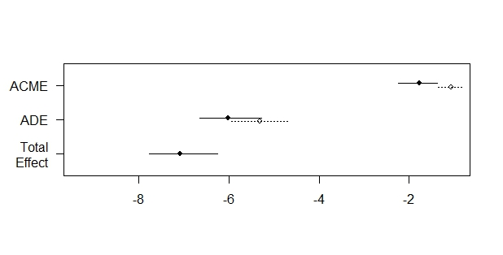
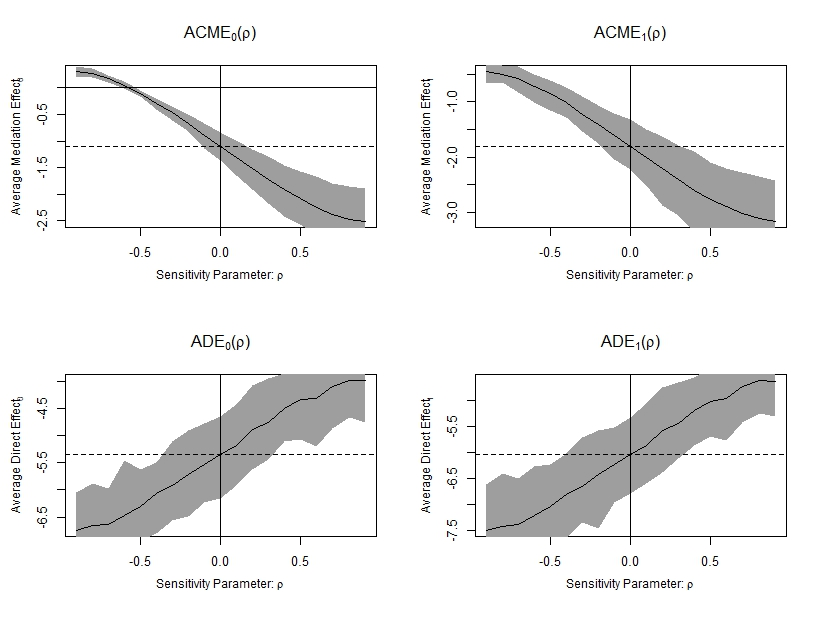

# G-computation {#ChapGcomp}

If we make the assumption that the intermediate confounder $L(1)$ of the $M-Y$ relationship is affected by the exposure $A$ (Causal model 2, Figure \@ref(fig:figDAGM2)), it is necessary to use other methods than traditional regressions models. To illustrate g-computation estimators, we will use the `df2_int.csv` data set, which was generated from a system corresponding to this assumption. Moreover, we will assume that there is an $A \star M$ interaction effect on the outcome.

G-computation can be used for the estimation of the total effect and two-way decomposition (CDE, marginal and conditional randomized direct and indirect effects). Analogs of the 3-way and 4-way decompositions are also given by the `CMAverse` package.


## Estimation of the Average Total Effect (ATE)

The following steps describe the implementation of the g-computation estimator of the average total effect $\text{ATE} = \mathbb{E}(Y_{A=1}) - \mathbb{E}(Y_{A=0})$:
                                          
1. Fit a logistic or a linear regression to estimate $\overline{Q} = \mathbb{E}(Y \mid A, L(0))$
                                            
2. Use this estimate to predict an outcome for each subject $\hat{\overline{Q}}(A=0)_i$ and $\hat{\overline{Q}}(A=1)_i$, by evaluating the regression fit $\overline{Q}$ at $A=0$ and $A=1$ respectively
                                          
3. Plug the predicted outcomes in the g-formula and use the sample mean to estimate $\Psi_{ATE}$
\begin{equation}
\hat{\Psi}^{\text{ATE}}_{\text{gcomp}} = \frac{1}{n} \sum_{i=1}^n \left[ \hat{\overline{Q}}(A=1)_i - \hat{\overline{Q}}(A=0)_i \right]
\end{equation}

For continuous outcomes, $\overline{Q}(A=a)$ functions can be estimated using linear regressions. For binary outcomes, they can be estimated using logistic regressions.

```{r gcomp_ATE, echo=TRUE, eval = FALSE}
## 0. Import data
rm(list=ls())
df2_int <- read.csv(file = "./data/df2_int.csv")

## 1. Estimate Qbar  
Q.tot.death <- glm(Y_death ~ A0_PM2.5 + L0_male + L0_soc_env, 
                   family = "binomial", data = df2_int)
Q.tot.qol <- glm(Y_qol ~ A0_PM2.5 + L0_male + L0_soc_env, 
                 family = "gaussian", data = df2_int)

## 2. Predict an outcome for each subject, setting A=0 and A=1
# prepare data sets used to predict the outcome under the counterfactual 
# scenarios setting A=0 and A=1
data.A1 <- data.A0 <- df2_int
data.A1$A0_PM2.5 <- 1
data.A0$A0_PM2.5 <- 0

# predict values
Y1.death.pred <- predict(Q.tot.death, newdata = data.A1, type = "response")
Y0.death.pred <- predict(Q.tot.death, newdata = data.A0, type = "response")

Y1.qol.pred <- predict(Q.tot.qol, newdata = data.A1, type = "response")
Y0.qol.pred <- predict(Q.tot.qol, newdata = data.A0, type = "response")

## 3. Plug the predicted outcome in the gformula and use the sample mean 
##    to estimate the ATE
ATE.death.gcomp <- mean(Y1.death.pred - Y0.death.pred)
ATE.death.gcomp
# [1] 0.08270821

ATE.qol.gcomp <- mean(Y1.qol.pred - Y0.qol.pred)
ATE.qol.gcomp
# [1] -8.360691
```


A 95% confidence interval can be estimated applying a bootstrap procedure. An example is given in the following code.
```{r gcomp_ATE_ic95, echo=TRUE, eval = FALSE}
set.seed(1234)
B <- 1000
bootstrap.estimates <- data.frame(matrix(NA, nrow = B, ncol = 2))
colnames(bootstrap.estimates) <- c("boot.death.est", "boot.qol.est")
for (b in 1:B){
  # sample the indices 1 to n with replacement
  bootIndices <- sample(1:nrow(df2_int), replace=T)
  bootData <- df2_int[bootIndices,]

  if (round(b/100, 0) == b/100 ) print(paste0("bootstrap number ",b))

  Q.tot.death <- glm(Y_death ~ A0_PM2.5 + L0_male + L0_soc_env,
                     family = "binomial", data = bootData)
  Q.tot.qol <- glm(Y_qol ~ A0_PM2.5 + L0_male + L0_soc_env,
                   family = "gaussian", data = bootData)

  boot.A.1 <- boot.A.0 <- bootData
  boot.A.1$A0_PM2.5 <- 1
  boot.A.0$A0_PM2.5 <- 0

  Y1.death.boot <- predict(Q.tot.death, newdata = boot.A.1, type = "response")
  Y0.death.boot <- predict(Q.tot.death, newdata = boot.A.0, type = "response")

  Y1.qol.boot <- predict(Q.tot.qol, newdata = boot.A.1, type = "response")
  Y0.qol.boot <- predict(Q.tot.qol, newdata = boot.A.0, type = "response")

  bootstrap.estimates[b,"boot.death.est"] <- mean(Y1.death.boot - Y0.death.boot)
  bootstrap.estimates[b,"boot.qol.est"] <- mean(Y1.qol.boot - Y0.qol.boot)
}

IC95.ATE.death <- c(ATE.death.gcomp - 
                      qnorm(0.975) * sd(bootstrap.estimates[,"boot.death.est"]),
                    ATE.death.gcomp + 
                      qnorm(0.975) * sd(bootstrap.estimates[,"boot.death.est"]))
IC95.ATE.death
# [1] 0.05612907 0.10928734

IC95.ATE.qol <- c(ATE.qol.gcomp - 
                    qnorm(0.975) * sd(bootstrap.estimates[,"boot.qol.est"]),
                  ATE.qol.gcomp + 
                    qnorm(0.975) * sd(bootstrap.estimates[,"boot.qol.est"]))
IC95.ATE.qol
# [1] -9.157856 -7.563526
```


## Estimation of Controlled Direct Effects (CDE)

The controlled direct effect $\Psi^{\text{CDE}_m} = \mathbb{E}(Y_{A=1,M=m}) - \mathbb{E}(Y_{A=0,M=m})$ is the difference between the mean outcome had the whole population been exposed to high levels of $\text{PM}_{2.5}$ (setting $A=1$), compared to the mean outcome had the whole population been unexposed (setting $A=0$), while keeping the mediator (type-2 diabetes) equal to a constant given value ($M=m$) in both scenarios.

The g-formula for a CDE ($\mathbb{E}(Y_{A=a^\prime,M=m})$) is more complex than for the average total effect, and the simple substitution approach described previously is less convenient to apply:

$\mathbb{E}(Y_{A=a^\prime,M=m}) = \sum_{l(0),l(1)} \left[ \mathbb{E}\left(Y \mid m, l(1), a^\prime, l(0) \right) \times P\left( L(1)=l(1) | a^\prime,l(0) \right) \right] \times P\left( L(0)=l(0) \right)$

In our simple example with a binary exposure $A$, a binary mediator $M$ and a binary intermediate confounder $L(1)$, it is still possible to apply the substitution approach (corresponding to a non-parametric g-computation estimation) by estimating the following components of the g-formula:

 - $\overline{Q}_Y(A,L(1),M)=\mathbb{E}\left(Y \mid L(0), A,L(1), M \right)$,
 - and $\overline{Q}_{L(1)}(A)=P\left(L(1)=1) \mid A, l(0)\right)$

We can then generate predicted outcomes from these 3 models for each subject in the data set, and obtain a _non-parametric maximum likelihood estimator (NPMLE)_ of the CDE using the empirical mean:
$$\scriptsize
\begin{array}{r l}
\Psi^{\text{CDE}_m}_{\text{NPMLE}} = \frac{1}{n}\sum & \left[\hat{\overline{Q}}_Y(A=1,L(1)=1,M=m) \times \hat{\overline{Q}}_{L(1)}(A=1) + \hat{\overline{Q}}_Y(A=1,L(1)=0,M=m) \times (1 - \hat{\overline{Q}}_{L(1)}(A=1))\right]\\
  &  - \left[\hat{\overline{Q}}_Y(A=0,L(1)=1,M=m) \times \hat{\overline{Q}}_{L(1)}(A=0) + \hat{\overline{Q}}_Y(A=0,L(1)=0,M=m) \times (1 - \hat{\overline{Q}}_{L(1)}(A=0))\right]
\end{array}$$

However NPMLE is tedious with high-dimensional intermediate confounders $L(1)$ or if mediators is repeated over time. In that case,  parametric g-computation using a Monte Carlo algorithm, or g-computation by iterative conditional expectation are easier to apply.

Below, we describe three g-computation procedures for the estimation of a CDE:

- parametric g-computation, using Monte Carlo simulation
- g-computation by iterative conditional expectation
- sequential g-estimator


### Parametric g-computation {#ChapGcomp-CDE-param}
Parametric g-computation by Monte Carlo simulation have been described by Robins [@robins1986], Taubman _et al._ [@taubman2009], or Daniel _et al._ [@daniel2013].

1. Fit a parametric model to estimate the density of the intermediate confounder $L(1)$ conditional on its parents. If $L(1)$ is a set of several variables, it is necessary to fit a model for each variable conditional on its parents (where the $L(1)$ variables are put in an arbitrary order). 
\begin{equation}
  Q_{L(1)}(A) = P(L(1)=1 \mid L(0),A)
\end{equation}


2. Fit a model of the outcome $Y$ conditional on its parents:
\begin{equation}
  \overline{Q}_Y(A,L(1),M) = \mathbb{E}\left(Y \mid L(0),A,L(1),M \right)
\end{equation}

                                            
3. Simulate individual values of $L(1)_a$ using the estimated density $\hat{Q}_{L(1)}(A=a)$ under the counterfactual scenarios setting $A=0$ or $A=1$

4. Estimate mean values of the outcome under the counterfactual scenarios setting $A=0$ (or $A=1$), $L(1)=l(1)_{A=0}$ (or $L(1)=l(1)_{A=1}$) and $M=m$, using $\hat{\overline{Q}}_Y(A=a,L(1)=l(1)_a,M=m)$
                                          
5. Estimate the controlled direct effect $\Psi_{\text{CDE}_m}$ by the sample mean:
\begin{equation}
  \small \hat{\Psi}^{\text{CDE}_m}_{\text{param.gcomp}} = \frac{1}{n} \sum_{i=1}^n \left[ \hat{\overline{Q}}_Y(A=1,L(1)=l(1)_{A=1},M=m)_i - \hat{\overline{Q}}_Y(A=0,L(1)=l(1)_{A=0},M=m)_i \right]
\end{equation}

For continuous outcomes, $\overline{Q}_Y(A,L(1),M)$ functions can be estimated using linear regressions. For binary outcomes, they can be estimated using logistic regressions.

```{r param_gcomp_CDE, echo=TRUE, eval = FALSE}
rm(list=ls())
df2_int <- read.csv(file = "data/df2_int.csv")

## 1. Fit parametric models to estimate the density of intermediate confounders, 
##    conditional on the parents of the intermediate confounders
L1.model <- glm(L1 ~ L0_male + L0_soc_env + A0_PM2.5, 
                family = "binomial", data = df2_int)

## 2. Fit parametric models for the outcome conditional on past
Y.death.model <- glm(Y_death ~ L0_male + L0_soc_env + A0_PM2.5 + L1 + 
                       M_diabetes + A0_PM2.5:M_diabetes, 
                     family = "binomial", data = df2_int)

Y.qol.model <- glm(Y_qol ~ L0_male + L0_soc_env + A0_PM2.5 + L1 + 
                     M_diabetes + A0_PM2.5:M_diabetes, 
                   family = "gaussian", data = df2_int)

## 3. Simulate individual L1 values under the counterfactual scenarios setting A0=0 or A0=1
set.seed(54321)
data.A0  <- data.A1 <- df2_int
data.A0$A0_PM2.5 <- 0
data.A1$A0_PM2.5 <- 1
p.L1.A0 <- predict(L1.model, newdata = data.A0, type="response")
p.L1.A1 <- predict(L1.model, newdata = data.A1, type="response")
sim.L1.A0 <- rbinom(n = nrow(df2_int), size = 1, prob = p.L1.A0)
sim.L1.A1 <- rbinom(n = nrow(df2_int), size = 1, prob = p.L1.A1)

## 4. Estimate mean outcomes under the counterfactual scenarios setting different 
##    levels of exposures for A and M:
##    {A=0, M=0} or {A=1, M=0} or {A=0, M=1} or {A=1, M=1}

data.A0.M0 <- data.A0.M1 <- data.A0
data.A1.M0 <- data.A1.M1 <- data.A1

# L1 variable is replaced by the simulated values in step 3)
data.A0.M0$L1 <- sim.L1.A0
data.A0.M1$L1 <- sim.L1.A0
data.A1.M0$L1 <- sim.L1.A1
data.A1.M1$L1 <- sim.L1.A1

# set M to 0 or 1
data.A0.M0$M_diabetes <- 0
data.A0.M1$M_diabetes <- 1
data.A1.M0$M_diabetes <- 0
data.A1.M1$M_diabetes <- 1

# predict the probability of death
p.death.A0.M0 <- predict(Y.death.model, newdata = data.A0.M0, type = "response")
p.death.A1.M0 <- predict(Y.death.model, newdata = data.A1.M0, type = "response")
p.death.A0.M1 <- predict(Y.death.model, newdata = data.A0.M1, type = "response")
p.death.A1.M1 <- predict(Y.death.model, newdata = data.A1.M1, type = "response")

# predict the mean value of QoL
m.qol.A0.M0 <- predict(Y.qol.model, newdata = data.A0.M0, type = "response")
m.qol.A1.M0 <- predict(Y.qol.model, newdata = data.A1.M0, type = "response")
m.qol.A0.M1 <- predict(Y.qol.model, newdata = data.A0.M1, type = "response")
m.qol.A1.M1 <- predict(Y.qol.model, newdata = data.A1.M1, type = "response")

## 5. Estimate the CDE
# CDE setting M=0
CDE.death.m0.gcomp.param <- mean(p.death.A1.M0) - mean(p.death.A0.M0)
CDE.death.m0.gcomp.param
# [1] 0.06289087

CDE.qol.m0.gcomp.param <- mean(m.qol.A1.M0) - mean(m.qol.A0.M0)
CDE.qol.m0.gcomp.param
# [1] -4.838654

# CDE setting M=1
CDE.death.m1.gcomp.param <- mean(p.death.A1.M1) - mean(p.death.A0.M1)
CDE.death.m1.gcomp.param
# [1] 0.08751016

CDE.qol.m1.gcomp.param <- mean(m.qol.A1.M1) - mean(m.qol.A0.M1)
CDE.qol.m1.gcomp.param
# [1] -10.35059
```


### G-computation by iterative conditional expectation {#ChapGcomp-CDE-ICE}
The following steps describe the implementation of the g-computation estimator by iterative conditional expectation for the component $\mathbb{E}(Y_{A=a^\prime,M=m})$ used in the definition of CDE $\Psi^{\text{CDE}_m} = \mathbb{E}(Y_{A=1,M=m}) - \mathbb{E}(Y_{A=0,M=m})$. Interestingly, there is no need to estimate or simulate $L(1)$ density with this method.
                                          
1. Fit a logistic or a linear regression of the final outcome, conditional on the exposure $A$, the mediator $M$ and all the parents of $Y$ preceding $M$, to estimate $\overline{Q}_{Y} = \mathbb{E}(Y \mid L(0),A,L(1),M)$;
                                            
2. Use this estimate to predict an outcome for each subject $\hat{\overline{Q}}_{Y}(A=a^\prime,M=m)_i$, by evaluating the regression fit $\overline{Q}_{Y}$ at the chosen value for the exposure $A=a^\prime$ and the mediator $M=m$;

3. Fit a quasibinomial or a linear regression of the predicted values $\hat{\overline{Q}}_{Y}(M=m)_i$ conditional on the exposure $A$ and baseline confounders $L(0)$ to estimate $\overline{Q}_{L(1)} = \mathbb{E}\left(\hat{\overline{Q}}_{Y}(A=a^\prime,M=m) \middle| L(0),A\right)$;

4. Use this estimate to predict the outcome $\hat{\overline{Q}}_{L(1)}(A=a^\prime)_i$ for each subject, by evaluating the regression fit $\overline{Q}_{L(1)}$ at $A=a^\prime$;
                                          
5. Use the sample mean to estimate $\Psi^{\text{CDE}_m}_{\text{gcomp}}$
\begin{equation}
\hat{\Psi}^{\text{CDE}_m}_{\text{gcomp}} = \frac{1}{n} \sum_{i=1}^n \left[ \hat{\overline{Q}}_{L(1)}(A=1)_i - \hat{\overline{Q}}_{L(1)}(A=0)_i \right]
\end{equation}

Note that G-computation by iterative expectation is preferable if the set of intermediate confounders $L(1)$ is high-dimensional as we only need to fit 1 model by counterfactual scenario (for a whole set of $L(1)$ variables) in the procedure described below, whereas at least 1 model by $L(1)$ variable and by counterfactual scenario are needed with parametric g-computation.

```{r gcomp_ice_CDE, echo=TRUE, eval = FALSE}
rm(list=ls())
df2_int <- read.csv(file = "data/df2_int.csv")

## 1) Regress the outcome on L0, A, L1 and M (and the A*M interaction if appropriate)
Y.death.model <- glm(Y_death ~ L0_male + L0_soc_env + A0_PM2.5 + L1 +
                       M_diabetes + A0_PM2.5:M_diabetes,
                     family = "binomial", data = df2_int)
Y.qol.model <- glm(Y_qol ~ L0_male + L0_soc_env + A0_PM2.5 + L1 +
                     M_diabetes + A0_PM2.5:M_diabetes,
                   family = "gaussian", data = df2_int)

# 2) Generate predicted values by evaluating the regression setting the exposure
#    and the mediator at exposure history of interest:
#    {A=1,M=0},{A=0,M=0},{A=1,M=1},{A=0,M=1}
data.Ais0.Mis0 <- data.Ais0.Mis1 <- df2_int
data.Ais1.Mis0 <- data.Ais1.Mis1 <- df2_int

data.Ais0.Mis0$A0_PM2.5 <- 0
data.Ais0.Mis0$M_diabetes <- 0

data.Ais0.Mis1$A0_PM2.5 <- 0
data.Ais0.Mis1$M_diabetes <- 1

data.Ais1.Mis0$A0_PM2.5 <- 1
data.Ais1.Mis0$M_diabetes <- 0

data.Ais1.Mis1$A0_PM2.5 <- 1
data.Ais1.Mis1$M_diabetes <- 1

Q.L2.death.A0M0 <- predict(Y.death.model, newdata = data.Ais0.Mis0, type="response")
Q.L2.death.A0M1 <- predict(Y.death.model, newdata = data.Ais0.Mis1, type="response")
Q.L2.death.A1M0 <- predict(Y.death.model, newdata = data.Ais1.Mis0, type="response")
Q.L2.death.A1M1 <- predict(Y.death.model, newdata = data.Ais1.Mis1, type="response")

Q.L2.qol.A0M0 <- predict(Y.qol.model, newdata = data.Ais0.Mis0, type="response")
Q.L2.qol.A0M1 <- predict(Y.qol.model, newdata = data.Ais0.Mis1, type="response")
Q.L2.qol.A1M0 <- predict(Y.qol.model, newdata = data.Ais1.Mis0, type="response")
Q.L2.qol.A1M1 <- predict(Y.qol.model, newdata = data.Ais1.Mis1, type="response")

## 3) Regress the predicted values conditional on the exposure A
##    and baseline confounders L(0)
L1.death.A0M0.model <- glm(Q.L2.death.A0M0 ~ L0_male + L0_soc_env + A0_PM2.5,
                           family = "quasibinomial", data = df2_int)
L1.death.A0M1.model <- glm(Q.L2.death.A0M1 ~ L0_male + L0_soc_env + A0_PM2.5,
                           family = "quasibinomial", data = df2_int)
L1.death.A1M0.model <- glm(Q.L2.death.A1M0 ~ L0_male + L0_soc_env + A0_PM2.5,
                           family = "quasibinomial", data = df2_int)
L1.death.A1M1.model <- glm(Q.L2.death.A1M1 ~ L0_male + L0_soc_env + A0_PM2.5,
                           family = "quasibinomial", data = df2_int)

L1.qol.A0M0.model <- glm(Q.L2.qol.A0M0 ~ L0_male + L0_soc_env + A0_PM2.5,
                         family = "gaussian", data = df2_int)
L1.qol.A0M1.model <- glm(Q.L2.qol.A0M1 ~ L0_male + L0_soc_env + A0_PM2.5,
                         family = "gaussian", data = df2_int)
L1.qol.A1M0.model <- glm(Q.L2.qol.A1M0 ~ L0_male + L0_soc_env + A0_PM2.5,
                         family = "gaussian", data = df2_int)
L1.qol.A1M1.model <- glm(Q.L2.qol.A1M1 ~ L0_male + L0_soc_env + A0_PM2.5,
                         family = "gaussian", data = df2_int)

## 4) generate predicted values by evaluating the regression at exposure 
##    of interest: {A=1} & {A=0}
Q.L1.death.A0M0 <- predict(L1.death.A0M0.model, newdata = data.Ais0.Mis0, type="response")
Q.L1.death.A0M1 <- predict(L1.death.A0M1.model, newdata = data.Ais0.Mis1, type="response")
Q.L1.death.A1M0 <- predict(L1.death.A1M0.model, newdata = data.Ais1.Mis0, type="response")
Q.L1.death.A1M1 <- predict(L1.death.A1M1.model, newdata = data.Ais1.Mis1, type="response")

Q.L1.qol.A0M0 <- predict(L1.qol.A0M0.model, newdata = data.Ais0.Mis0, type="response")
Q.L1.qol.A0M1 <- predict(L1.qol.A0M1.model, newdata = data.Ais0.Mis1, type="response")
Q.L1.qol.A1M0 <- predict(L1.qol.A1M0.model, newdata = data.Ais1.Mis0, type="response")
Q.L1.qol.A1M1 <- predict(L1.qol.A1M1.model, newdata = data.Ais1.Mis1, type="response")

## 5) Take empirical mean of final predicted outcomes to estimate CDE
# CDE setting M=0
CDE.death.m0.gcomp.ice <- mean(Q.L1.death.A1M0) - mean(Q.L1.death.A0M0)
CDE.death.m0.gcomp.ice
# [1] 0.06342833

CDE.qol.m0.gcomp.ice <- mean(Q.L1.qol.A1M0) - mean(Q.L1.qol.A0M0)
CDE.qol.m0.gcomp.ice
# [1] -4.869509

# CDE setting M=1
CDE.death.m1.gcomp.ice <- mean(Q.L1.death.A1M1) - mean(Q.L1.death.A0M1)
CDE.death.m1.gcomp.ice
# [1] 0.08812318

CDE.qol.m1.gcomp.ice <- mean(Q.L1.qol.A1M1) - mean(Q.L1.qol.A0M1)
CDE.qol.m1.gcomp.ice
# [1] -10.38144
```

#### G-computation by ICE using the `ltmle` package

The `ltmle` package can be used to estimate Controlled Direct Effects by g-computation.

An application is shown below.

```{r gcomp_ltmle, echo=TRUE, eval = FALSE}
library(ltmle)
rm(list=ls())
df2_int <- read.csv(file = "./data/df2_int.csv")

# the data set should be composed of continuous or binary variables,
# ordered following the cause-effect sequence of each variables.
# Note that within a set of exposures or intermediate confounders measured at a
# single discrete time t, any causal sequence can be applied (for example,
# with several L1 variable, it can be {L1.1, L1.2, L1.3} or {L1.2,L1.3,L1.1},
# without any consequences on the estimation.
df.death <- subset(df2_int, select = -Y_qol)
df.qol <- subset(df2_int, select = -Y_death)

## 1) Define Q formulas (Qbar_L1 and Qbar_Y functions)
Q_formulas.death <- c(L1 = "Q.kplus1 ~ L0_male + L0_soc_env + A0_PM2.5",
                      Y_death = "Q.kplus1 ~ L0_male + L0_soc_env + L1 +
                                 A0_PM2.5 * M_diabetes") # add interaction
Q_formulas.qol <- c(L1 = "Q.kplus1 ~ L0_male + L0_soc_env + A0_PM2.5",
                    Y_qol = "Q.kplus1 ~ L0_male + L0_soc_env + L1 +
                             A0_PM2.5 * M_diabetes") # add interaction
## 2) Define g formulas (needed for the ltmle package) but they are not used
#    with the g-computation estimator
g_formulas <- c("A0_PM2.5 ~ L0_male + L0_soc_env", 
                "M_diabetes ~ L0_male + L0_soc_env + A0_PM2.5 + L1")

## 3) Use the ltmle() function
# arguments:
#  - Anodes: indicate the exposure and the mediator variables
#  - Lnodes: indicate the intermediate confounders (+/- baseline confounders)
#  - Cnodes: censoring nodes, useless in our example
#  - Ynodes: outcome variable
#  - survivalOutcome = FALSE in our example
#  - abar: list of the two values used to define counterfactual outcomes
#          for the contrast of interest. For example, setting M=0,
#          CDE(M=0) = E(Y_{A=1,M=0}) - E(Y_{A=0,M=0})
#  - rule: to define dynamic rules (useless in our example)
#  - gbounds = c(0.01, 1) by default. This parameter is not used with g-computation
#  - Yrange = NULL, can be used to define range (min,max) for continuous outcomes
#  - SL.library = "glm",  will apply main terms glm models.
#                 The argument can be used to specify SuperLearner libraries.
#                 However, simple glm models might be preferable as data.adaptive
#                 algorithms rely on cross-validation, which is difficult and long to
#                 implement with the bootstrap procedure needed for 95% confidence
#                 intervals
#  - stratify = FALSE by default. If TRUE, glm estimations are stratified for
#               each counterfactual scenario defined in abar.
#  - estimate.time = FALSE. If TRUE, print a rough estimate of computation time
#  - iptw.only = FALSE, useless with g-computation
#  - variance.method = "ic", computation is faster than with "tmle" which
#  -                     is useless with g-comp: variance estimates rely on
#                        influence curves which cannot be used with g-comp because
#                       g-computation is not a asymptotically efficient estimator.
#  - observation.weights = NULL, can be used to specify individual weights

## With a binary outcome, CDE(M=1) = P(Y_{A=1,M=0} = 1) - P(Y_{A=0,M=0} = 1)
ltmle.gcomp.CDE.M0 <- ltmle(data = df.death,
                            Anodes = c("A0_PM2.5", "M_diabetes"),
                            Lnodes = c("L1"),
                            Ynodes = c("Y_death"), # binary outcome
                            survivalOutcome = FALSE,
                            Qform = Q_formulas.death, # Q formulas
                            gform = g_formulas, # g formulas
                            abar = list(c(1,0),c(0,0)), # Y_{A=1,M=0} vs Y_{A=0,M=0}
                            rule = NULL,
                            gbounds = c(0.01, 1), # by default
                            Yrange = NULL,
                            deterministic.g.function = NULL,
                            stratify = FALSE,
                            SL.library = "glm",
                            SL.cvControl = list(),
                            estimate.time = FALSE,
                            gcomp = TRUE, # should be TRUE for g-computation
                            iptw.only = FALSE,
                            deterministic.Q.function = NULL,
                            variance.method = "ic",
                            observation.weights = NULL,
                            id = NULL)
summary(ltmle.gcomp.CDE.M0)
# Additive Treatment Effect:
#   Parameter Estimate:  0.063428 # same as manual computation
#    Estimated Std Err:  0.018159
#              p-value:  0.00047789
#    95% Conf Interval: (0.027836, 0.09902) # those 95%CI should not be used
#                      => apply a bootstrap computation instead

## With a continuous outcome, CDE(M=1) = E(Y_{A=1,M=1}) - E(Y_{A=0,M=1})
ltmle.gcomp.CDE.M1 <- ltmle(data = df.qol,
                            Anodes = c("A0_PM2.5", "M_diabetes"),
                            Lnodes = c("L1"),
                            Ynodes = c("Y_qol"), # continous outcome
                            survivalOutcome = FALSE,
                            Qform = Q_formulas.qol, # Q formulas
                            gform = g_formulas, # g formulas
                            abar = list(c(1,1),c(0,1)), # Y_{A=1,M=1} vs Y_{A=0,M=1}
                            rule = NULL,
                            gbounds = c(0.01, 1), # by default
                            Yrange = NULL,
                            deterministic.g.function = NULL,
                            stratify = FALSE,
                            SL.library = "glm",
                            SL.cvControl = list(),
                            estimate.time = FALSE,
                            gcomp = TRUE, # should be TRUE for g-computation
                            iptw.only = FALSE,
                            deterministic.Q.function = NULL,
                            variance.method = "ic",
                            observation.weights = NULL,
                            id = NULL)
summary(ltmle.gcomp.CDE.M1)
# Additive Treatment Effect:
#   Parameter Estimate:  -10.432
#    Estimated Std Err:  0.55975
#              p-value:  <2e-16
#    95% Conf Interval: (-11.529, -9.335) those 95%CI should not be used
#                      => apply a bootstrap computation instead

# For quantitative outcomes, the outcome is first transformed into a continuous variable
# with [0;1] range: Y' = (Y - min(Y)) / (max(Y) - min(Y)) to run a quasi-binomial
# regression, and then estimations are back-transformed on the original scale.

```


### Sequential g-estimator
For quantitative outcomes, Vansteelandt et al. (Epidemiology 20(6);2009) described a sequential g-estimator for CDE. An extension for binary outcomes in case-control studies is also described using OR. 

The following 2 steps are applied:

1. Fit a regression model for the outcome conditional on the exposure $A$, the mediator $M$, baseline and intermediate confounders $L(0)$ and $L(1)$, in order to estimate the regression coefficients $\hat{\gamma}_{M}$ and $\hat{\gamma}_{A \ast M}$ (in case of $(A \ast M)$ interaction effect).
\begin{equation}
\mathbb{E}(Y\mid L(0),A,L(1),M) = \gamma_0 + \gamma_A A + \gamma_M M + \psi_{A \ast M} (A \ast M) + \gamma_{L(0)} L(0) + \gamma_{L(1)} L(1)
\end{equation}

2. Remove the effect of mediator on the outcome, by evaluating the residual outcome:
\begin{equation}
Y_{res} = Y - \hat{\gamma}_M M - \hat{\psi}_{A \ast M} \times A \times M
\end{equation}

and regress the residual outcome on the exposure $A$ and baseline confounders $L(0)$: 
\begin{equation}
\mathbb{E}(Y_{res}\mid A, L(0)) = \alpha_0 + \psi_A A + \beta_{L(0)} L(0)
\end{equation}

The controlled direct effect $\text{CDE}_m$ can then be estimated by:
\begin{equation}
\hat{\Psi}^{\text{CDE}_m}_{\text{seq.g.est}} = \hat{\psi}_A + \hat{\psi}_{A \ast M} \times m
\end{equation}


```{r seq_g_estimator_CDE, echo=TRUE, eval = FALSE}
rm(list=ls())
df2_int <- read.csv(file = "data/df2_int.csv")

## 1) Regress the outcome on past
Y.qol.model <- glm(Y_qol ~ L0_male + L0_soc_env + A0_PM2.5 + L1 +
                     M_diabetes + A0_PM2.5:M_diabetes,
                   family = "gaussian", data = df2_int)

## 2) Calculate a residual outcome Y - (coef.M * M_diabetes) - (coef.A0:M * A0:M)
Y.res <- (df2_int$Y_qol -
            (Y.qol.model$coefficients["M_diabetes"] * df2_int$M_diabetes) -
            (Y.qol.model$coefficients["A0_PM2.5:M_diabetes"] * df2_int$A0_PM2.5 *
               df2_int$M_diabetes) )

## 3) Regress the residual outcome on the exposure A and baseline confounders L(0)
Y.res.model <- glm(Y.res ~ L0_male + L0_soc_env + A0_PM2.5,
                   family = "gaussian", data = df2_int)

## 4) Use coefficients estimated from the 1st and 2nd regression to estimate CDE:
CDE.qol.m0.seq <- (Y.res.model$coefficients["A0_PM2.5"] + 
                     0 * Y.qol.model$coefficients["A0_PM2.5:M_diabetes"])
CDE.qol.m0.seq
# -4.869509

CDE.qol.m1.seq <- (Y.res.model$coefficients["A0_PM2.5"] + 
                     1 * Y.qol.model$coefficients["A0_PM2.5:M_diabetes"])
CDE.qol.m1.seq
# -10.38144
```


## Estimation of Natural Direct (NDE) and Indirect Effects (NIE)
When Natural Direct Effects and Natural Indirect Effects are identifiable (i.e. making the assumption that the confounder $L(1)$ of the $M-Y$ relationship is NOT affected by the exposure $A$ as in Causal model 1, in Figure \@ref(fig:figDAGM1)), estimations are based on traditional regression models as described in chapter \@ref(ChapTradRegModels).

The g-formulas for the PNDE and TNIE are:
\begin{align*}
  \Psi^\text{PNDE} &= \sum_{l(0),l(1)} \sum_m \left[ \mathbb{E}\left(Y \mid A=1,m,l(0),l(1)\right) - \left(Y \mid A=0,m,l(0),l(1)\right) \right] \\
  & \qquad \qquad \quad \times \mathbb{P}\left(M=m \mid A=0,l(0),l(1)\right) \times \mathbb{P}(l(0),l(1)) \\
  \Psi^\text{TNIE} &= \sum_{l(0),l(1)} \sum_m \mathbb{E}\left(Y \mid A=1,m,l(0),l(1)\right) \\
  & \qquad \qquad \quad \times \left[ \mathbb{P}\left(M=m \mid A=1,l(0),l(1)\right) - \mathbb{P}\left(M=m \mid A=0,l(0),l(1)\right) \right] \\
  & \qquad \qquad \quad \times \mathbb{P}(l(0),l(1))
\end{align*}

### Simple "plug-in" estimator
```{r pluginPndePnie, echo=TRUE, eval = FALSE}
## For the example, we will use the df1_int.csv data set (with an A*M interaction
## effect on the outcome, but no intermediate confounder affected by the exposure)
rm(list=ls())
df1_int <- read.csv(file = "./data/df1_int.csv")

## 1) Regress a model of the mediator and models of the outcomes (for binary and
##    continuous outcomes)
# Estimate a model of the mediator (logistic regression)
trad_m <- glm(M_diabetes ~ A0_PM2.5 + L0_male + L0_soc_env + L1, 
              family = "binomial",
              data = df1_int)

# Estimate models of the outcome (for continuous and binary outcomes)
trad_qol_am <- lm(Y_qol ~ A0_PM2.5 + M_diabetes + A0_PM2.5:M_diabetes +
                    L0_male + L0_soc_env + L1,
                  data = df1_int)
trad_death_am <- glm(Y_death ~ A0_PM2.5 + M_diabetes + A0_PM2.5:M_diabetes +
                       L0_male + L0_soc_env + L1,
                     family = "binomial",
                     data = df1_int)

## 2) Generate predicted values for every combination of A={0,1} and M={0,1}
## 2.a) Predict counterfactual probabilities of the mediator
data.Ais0 <- data.Ais1 <- df1_int
data.Ais0$A0_PM2.5 <- 0
data.Ais1$A0_PM2.5 <- 1

# Predict the counterfactual probabilities
# P(M_{A=0}|l(0),l(1)) and  P(M_{A=1}|l(0),l(1))
P.M.Ais0 <- predict(trad_m, newdata = data.Ais0, type = "response")
P.M.Ais1 <- predict(trad_m, newdata = data.Ais1, type = "response")

## 2.b) Predict counterfactual expected values of the outcomes
data.Ais0.Mis0 <- data.Ais0.Mis1 <- df1_int
data.Ais1.Mis0 <- data.Ais1.Mis1 <- df1_int

data.Ais0.Mis0$A0_PM2.5 <- 0
data.Ais0.Mis0$M_diabetes <- 0

data.Ais0.Mis1$A0_PM2.5 <- 0
data.Ais0.Mis1$M_diabetes <- 1

data.Ais1.Mis0$A0_PM2.5 <- 1
data.Ais1.Mis0$M_diabetes <- 0

data.Ais1.Mis1$A0_PM2.5 <- 1
data.Ais1.Mis1$M_diabetes <- 1

# Predict E(Y_{am} | l(0),l(1))
Q.death.A0M0 <- predict(trad_death_am, newdata = data.Ais0.Mis0, type="response")
Q.death.A0M1 <- predict(trad_death_am, newdata = data.Ais0.Mis1, type="response")
Q.death.A1M0 <- predict(trad_death_am, newdata = data.Ais1.Mis0, type="response")
Q.death.A1M1 <- predict(trad_death_am, newdata = data.Ais1.Mis1, type="response")

Q.qol.A0M0 <- predict(trad_qol_am, newdata = data.Ais0.Mis0, type="response")
Q.qol.A0M1 <- predict(trad_qol_am, newdata = data.Ais0.Mis1, type="response")
Q.qol.A1M0 <- predict(trad_qol_am, newdata = data.Ais1.Mis0, type="response")
Q.qol.A1M1 <- predict(trad_qol_am, newdata = data.Ais1.Mis1, type="response")


## 3) Plug-in the predicted values in the g-formulas 
##    and estimate the population means
PNDE.death.gcomp <- mean((Q.death.A1M0 - Q.death.A0M0) * (1 - P.M.Ais0) +
                           (Q.death.A1M1 - Q.death.A0M1) * P.M.Ais0)
# [1] 0.0638596
TNIE.death.gcomp <- mean(Q.death.A1M0 * ((1 - P.M.Ais1) - (1 - P.M.Ais0)) +
                           Q.death.A1M1 * (P.M.Ais1 - P.M.Ais0) )
# [1] 0.01044539

PNDE.qol.gcomp <- mean((Q.qol.A1M0 - Q.qol.A0M0) * (1 - P.M.Ais0) +
                           (Q.qol.A1M1 - Q.qol.A0M1) * P.M.Ais0)
# [1] -5.310172
TNIE.qol.gcomp <- mean(Q.qol.A1M0 * ((1 - P.M.Ais1) - (1 - P.M.Ais0)) +
                         Q.qol.A1M1 * (P.M.Ais1 - P.M.Ais0) )
# [1] -1.774295
```


### Using the `CMAverse` R package
```{r PNDE_TNDE_CMAverse, echo=TRUE, eval = FALSE}
library(CMAverse)
set.seed(1234)
res_rb_param_delta <- cmest(data = df1_int,
                            model = "rb", # for "regression based" (rb) approach
                            outcome = "Y_qol",        # outcome variable
                            exposure = "A0_PM2.5",    # exposure variable
                            mediator = "M_diabetes",  # mediator
                            basec = c("L0_male",      # confounders
                                      "L0_soc_env",
                                      "L1"),
                            EMint = TRUE, # exposures*mediator interaction
                            mreg = list("logistic"), # model of the mediator
                            yreg = "linear",       # model of the outcome
                            astar = 0,
                            a = 1,
                            mval = list(0),
                            estimation = "imputation", #  closed-form parameter
                            # function estimation
                            inference = "bootstrap") # IC95% : "delta" or "bootstrap"
summary(res_rb_param_delta)
#                Estimate Std.error  95% CIL 95% CIU  P.val
#   cde          -3.71527   0.42805 -4.54643  -2.944 <2e-16 ***
#   pnde         -5.10339   0.34582 -6.02478  -4.719 <2e-16 *** vs -5.310172
#   tnde         -5.65988   0.35217 -6.76655  -5.342 <2e-16 ***
#   pnie         -0.85540   0.14386 -1.35738  -0.827 <2e-16 ***
#   tnie         -1.41189   0.23667 -2.19506  -1.370 <2e-16 *** vs -1.774295
#   te           -6.51528   0.41465 -8.05718  -6.394 <2e-16 ***
#   intref       -1.38812   0.18813 -1.92391  -1.226 <2e-16 ***
#   intmed       -0.55649   0.11655 -0.91444  -0.473 <2e-16 ***
#   cde(prop)     0.57024   0.04454  0.43771   0.608 <2e-16 ***
#   intref(prop)  0.21306   0.03102  0.16866   0.284 <2e-16 ***
#   intmed(prop)  0.08541   0.01511  0.06924   0.131 <2e-16 ***
#   pnie(prop)    0.13129   0.01686  0.12098   0.186 <2e-16 ***
#   pm            0.21670   0.02821  0.19441   0.305 <2e-16 ***
#   int           0.29847   0.04113  0.24601   0.400 <2e-16 ***
#   pe            0.42976   0.04454  0.39163   0.562 <2e-16 ***


set.seed(1234)
res_rb_param_delta <- cmest(data = df1_int,
                            model = "rb", # for "regression based" (rb) approach
                            outcome = "Y_death",        # outcome variable
                            exposure = "A0_PM2.5",    # exposure variable
                            mediator = "M_diabetes",  # mediator
                            basec = c("L0_male",      # confounders
                                      "L0_soc_env",
                                      "L1"),
                            EMint = TRUE, # exposures*mediator interaction
                            mreg = list("logistic"), # model of the mediator
                            yreg = "linear",       # model of the outcome
                            astar = 0,
                            a = 1,
                            mval = list(0),
                            estimation = "imputation", #  closed-form parameter
                            # function estimation
                            inference = "bootstrap") # IC95% : "delta" or "bootstrap"
summary(res_rb_param_delta)
# Estimate Std.error   95% CIL 95% CIU  P.val
#   cde           0.060001  0.016971  0.029741   0.096 <2e-16 ***
#   pnde          0.064743  0.013036  0.040779   0.094 <2e-16 *** vs 0.0638596
#   tnde          0.066644  0.012808  0.041684   0.095 <2e-16 ***
#   pnie          0.006696  0.001666  0.005635   0.012 <2e-16 ***
#   tnie          0.008597  0.003576  0.003856   0.018   0.02 *   vs 0.01044539
#   te            0.073340  0.012905  0.049302   0.102 <2e-16 ***
#   intref        0.004742  0.008584 -0.011243   0.021   0.51
#   intmed        0.001901  0.003764 -0.005370   0.009   0.51
#   cde(prop)     0.818122  0.160328  0.501113   1.108 <2e-16 ***
#   intref(prop)  0.064653  0.115196 -0.151420   0.270   0.51
#   intmed(prop)  0.025919  0.050149 -0.069991   0.121   0.51
#   pnie(prop)    0.091306  0.029324  0.067935   0.178 <2e-16 ***
#   pm            0.117225  0.052331  0.053291   0.245   0.02 *
#   int           0.090572  0.164830 -0.223164   0.400   0.51
#   pe            0.181878  0.160328 -0.108220   0.499   0.15
```


### Using the `mediation` R package
The [`mediation`](https://cran.r-project.org/web/packages/mediation/index.html) R package can be used to estimate Natural Direct and Indirect Effects for causal models where the intermediate confounders are not affected by the exposure (as in Figure \@ref(fig:figDAGM1)).

The estimation relies on the model of the mediator and the model of the outcome. Then a quasi-bayesian Monte Carlo method is applied, simulating counterfactual distributions of the mediator. The approach is rather similar to the parametric g-computation to estimate "Marginal" Randomized/Interventional Direct and Indirect Effects, described in the next paragraph.

Note that the `mediation` package can also be used for multilevel data.

```{r mediationPackage1, echo=TRUE, eval = FALSE}
## Using the "mediation" package : R Package for Causal Mediation Analysis
library(mediation)
?mediation::mediate

## We will use the previous model of the mediator (logistic regression)
trad_m
# Call:  glm(formula = M_diabetes ~ A0_PM2.5 + L0_male + L0_soc_env +
#              L1, family = "binomial", data = df1_int)
# Coefficients:
#   (Intercept)     A0_PM2.5      L0_male   L0_soc_env           L1
#       -1.3788       0.5626       0.2586       0.3305       0.3346

## We will use the previous models of the outcomes (continuous and binary outcomes)
trad_qol_am
# Call:
#   lm(formula = Y_qol ~ A0_PM2.5 + M_diabetes + A0_PM2.5:M_diabetes +
#        L0_male + L0_soc_env + L1, data = df1_int)
# Coefficients:
# (Intercept) A0_PM2.5  M_diabetes  L0_male L0_soc_env       L1  A0_PM2.5:M_diabetes
#    74.7669   -3.7153     -8.6317  -0.7235    -2.8899  -3.4280              -5.6154

trad_death_am
# Call:  glm(formula = Y_death ~ A0_PM2.5 + M_diabetes + A0_PM2.5:M_diabetes +
#              L0_male + L0_soc_env + L1, family = "binomial", data = df1_int)
# Coefficients:
# (Intercept) A0_PM2.5  M_diabetes  L0_male L0_soc_env       L1  A0_PM2.5:M_diabetes
#    -2.06294  0.36668     0.40921  0.29249    0.36360  0.44716              0.01275

## Use the mediate() function to estimate the TNDE, PNIE
## Estimations relies on quasi-bayesian Monte Carlo method (especially for continuous
## mediators) => set seed for reproducibility
set.seed(2024)

## For the quantitative outcome
mediation.res.qol <- mediate(trad_m,                   # model of the mediator
                             trad_qol_am,              # model of the outcome
                             treat = "A0_PM2.5",       # exposure
                             mediator = "M_diabetes",  # mediator
                             robustSE = TRUE,          # estimate sandwich SEs
                             sims = 100)               # better to use >= 1000
summary(mediation.res.qol)
#                            Estimate 95% CI Lower 95% CI Upper p-value
#   ACME (control)             -1.074       -1.356        -0.82  <2e-16 *** PNIE
#   ACME (treated)             -1.778       -2.239        -1.38  <2e-16 *** TNIE
#   ADE (control)              -5.301       -5.950        -4.63  <2e-16 *** PNDE
#   ADE (treated)              -6.005       -6.646        -5.27  <2e-16 *** TNDE
#   Total Effect               -7.079       -7.768        -6.24  <2e-16 ***
#   Prop. Mediated (control)    0.151        0.118         0.19  <2e-16 ***
#   Prop. Mediated (treated)    0.251        0.197         0.31  <2e-16 ***
#   ACME (average)             -1.426       -1.811        -1.11  <2e-16 ***
#   ADE (average)              -5.653       -6.267        -4.95  <2e-16 ***
#   Prop. Mediated (average)    0.201        0.160         0.25  <2e-16 ***
```

In the output, 

  - `ACME (control)` (Average Causal Mediated Effect) corresponds to the Pure Natural Indirect Effect,
  - `ACME (treated)` corresponds to the Total Natural Indirect Effect,
  - `ADE (control) ` (Average Direct Effect) corresponds to the Pure Natural Direct Effect,
  - `ADE (treated)` corresponds to the Total Natural Direct Effect,

So the sum of ACME (control) + ADE (treated) is equal to the total effect. Similarly, the sum of ACME (treated) + ADE (control) is equal to the total effect.

We can plot the results. For example the results for the decomposition of the effect of exposure to high-levels of $\text{PM}_{2.5}$ on quality of life, through type-2 diabetes is described in the Figure 
```{r mediationPackage2, echo=TRUE, eval = FALSE}
## Plot the estimations
plot(mediation.res.qol)
```

```{r FigmediationPackage, echo=FALSE, out.width="80%", fig.align="center", fig.cap="Plot of the 2-way decomposition (mediation package)"}
  
```

For the binary outcome:
```{r mediationPackage3, echo=TRUE, eval = FALSE}
mediation.res.death <- mediate(trad_m,                   # model of the mediator
                               trad_death_am,            # model of the outcome)
                               treat = "A0_PM2.5",       # exposure
                               mediator = "M_diabetes",  # mediator
                               robustSE = TRUE,          # estimate sandwich SEs
                               sims = 100)               # better to use >= 1000
summary(mediation.res.death)
#                          Estimate 95% CI Lower 95% CI Upper p-value
# ACME (control)            0.00860      0.00569         0.01  <2e-16 *** PNIE
# ACME (treated)            0.00979      0.00377         0.02  <2e-16 *** TNIE
# ADE (control)             0.06543      0.03658         0.09  <2e-16 *** PNDE
# ADE (treated)             0.06662      0.03946         0.09  <2e-16 *** TNDE
# Total Effect              0.07522      0.04800         0.10  <2e-16 ***
# Prop. Mediated (control)  0.11172      0.07323         0.18  <2e-16 ***
# Prop. Mediated (treated)  0.13066      0.05714         0.22  <2e-16 ***
# ACME (average)            0.00920      0.00567         0.01  <2e-16 ***
# ADE (average)             0.06603      0.03803         0.09  <2e-16 ***
# Prop. Mediated (average)  0.12119      0.07330         0.20  <2e-16 ***
```

Interestingly, the `mediation` package enable to carry-out a sensitivity analysis to test if unmeasured confounders of the mediator-outcome relationship could offset the estimated direct or indirect effects. This sensitivity analysis relies on assumptions on the mediator-outcome correlation coefficient. I.e., it can be used to test for unmeasured variables within the $L(1)$ set in the causal structure of Figure \@ref(fig:figDAGM1).

If there exist unobserved (baseline) confounders of the M-Y relationship, we expect that $\rho$ is no longer zero. The sensitivity analysis is conducted by varying the value of $\rho$ and examining how the estimated ACME and ADE change.

Note 1: this sensitivity analysis cannot be used to test the assumption that no intermediate confounder $L(1)$ of the mediator-outcome relationship is affected by the exposure (like in Figure \@ref(fig:figDAGM2)).

Note 2: Sensitivity analysis from the `mediation` package cannot be applied when the mediator and the outcome are both binary. We will only use it for the "Quality of Life" outcome.

```{r medsens, echo=TRUE, eval = FALSE}
## Sensitivity analysis to test sequential ignorability (assess the possible 
## existence of unobserved (baseline) confounders of the M-Y relationship)

## Estimate a probit model of the mediator
trad_m <- glm(M_diabetes ~ A0_PM2.5 + L0_male + L0_soc_env + L1,
              family = binomial("probit"), # sensitivity analysis works only for
                                           # probit models if M is binary
              data = df1_int)
mediation.res.qol <- mediate(trad_m,                   # model of the mediator
                             trad_qol_am,              # model of the outcome)
                             treat = "A0_PM2.5",       # exposure
                             mediator = "M_diabetes",  # mediator
                             robustSE = TRUE,          # estimate sandwich SEs
                             sims = 100)               # better to use >= 1000
summary(mediation.res.qol)
#                            Estimate 95% CI Lower 95% CI Upper p-value
#   ACME (control)             -1.071       -1.416        -0.79  <2e-16 ***
#   ACME (treated)             -1.784       -2.333        -1.31  <2e-16 ***
#   ADE (control)              -5.266       -5.809        -4.56  <2e-16 ***
#   ADE (treated)              -5.979       -6.515        -5.31  <2e-16 ***
#   Total Effect               -7.050       -7.754        -6.34  <2e-16 ***
#   Prop. Mediated (control)    0.151        0.119         0.19  <2e-16 ***
#   Prop. Mediated (treated)    0.254        0.194         0.32  <2e-16 ***
#   ACME (average)             -1.427       -1.889        -1.06  <2e-16 ***
#   ADE (average)              -5.623       -6.152        -4.97  <2e-16 ***
#   Prop. Mediated (average)    0.203        0.159         0.26  <2e-16 ***

sensisitivy <- medsens(mediation.res.qol,
                       rho.by = 0.1, # sensitivity parameter = correlation between
                       # the residuals of the mediator & outcome regressions
                       # here, rho varies from -0.9 to +0.9 by 0.1 increments
                       effect.type = "both", # "direct", "indirect" or "both"
                       sims = 100) # better to use >= 1000
summary(sensisitivy)
# Mediation Sensitivity Analysis: Average Mediation Effect
#   Sensitivity Region: ACME for Control Group
#         Rho ACME(control) 95% CI Lower 95% CI Upper R^2_M*R^2_Y* R^2_M~R^2_Y~
#   [1,] -0.6        0.0474      -0.0093       0.1229         0.36       0.2647
#
# Rho at which ACME for Control Group = 0: -0.6
# R^2_M*R^2_Y* at which ACME for Control Group = 0: 0.36
# R^2_M~R^2_Y~ at which ACME for Control Group = 0: 0.2647
#
# Rho at which ACME for Treatment Group = 0: -0.9
# R^2_M*R^2_Y* at which ACME for Treatment Group = 0: 0.81
# R^2_M~R^2_Y~ at which ACME for Treatment Group = 0: 0.5956
#
#   Mediation Sensitivity Analysis: Average Direct Effect
# Rho at which ADE for Control Group = 0: 0.8
# R^2_M*R^2_Y* at which ADE for Control Group = 0: 0.64
# R^2_M~R^2_Y~ at which ADE for Control Group = 0: 0.4706
#
# Rho at which ADE for Treatment Group = 0: 0.8
# R^2_M*R^2_Y* at which ADE for Treatment Group = 0: 0.64
# R^2_M~R^2_Y~ at which ADE for Treatment Group = 0: 0.4706

par(mfrow = c(2,2))
plot(sensisitivy)
par(mfrow = c(1,1))
```

```{r Figmedsens, echo=FALSE, out.width="80%", fig.align="center", fig.cap="Sensitivity analysis testing unmeasured confounding of the M-Y relationship"}
  
```

Here, for the Pure Natural Indirect Effect: 
  
  - the confidence interval of the ACME (PNIE) contains zero when $\rho=-0.6$;
  - when the product of the residual variance explained by the omitted confounding is 0.36, the point estimate of PNIE = 0;
  - when the product of the total variance explained by the omitted confounding is 0.27, the point estimate of PNIE = 0;
  
For the TNDE and PNDE, 

  - the confidence interval of the ADE (TNDE and PNDE) containt zero when $\rho > +0.8$;
  - when the product of the residual variance explained by the omitted confounding is 0.64, the point estimate of TNDE = 0;
  - when the product of the total variance explained by the omitted confounding is 0.47, the point estimate of TNDE = 0;
  
We can conclude that the possibility of the PNIE and the TNIE cancelling out because of unmeasured M-Y confounding is unlikely in our example (it requires rather strong correlations).

## Estimation of "Marginal" Randomized/Interventional Natural Direct (MRDE) and Indirect Effects (MRIE)
When we assume that the intermediate confounder $L(1)$ of the $M-Y$ relationship is affected by the exposure $A$ (Causal model 2, Figure \@ref(fig:figDAGM2)), an "interventional analogue" of the Average Total Effect decomposition into a Natural Direct and Indirect Effect has been suggested.[@vanderweele2016] [@lin2017] For these effects, counterfactual scenarios are defined by setting different values for the exposure ($A = 0$ or $A=1$) and random draw in the distribution $G_{A=a^\prime \mid L(0)}$ of the mediator (conditional on baseline counfounders $L(0)$) under the counterfactual scenario setting $A=a^\prime$.

An Overall (Total) Effect can be defined by the contrast $\text{OE} = \mathbb{E}\left[Y_{A=1,G_{A=1\mid L(0)}} \right] - \mathbb{E}\left[ Y_{A=0,G_{A=0\mid L(0)}} \right]$.

This Overall Effect can be decomposed into the sum of:

  - a Marginal Randomised (or Interventional) Direct Effect: $\text{MRDE}=\mathbb{E}\left[Y_{A=1,G_{A=0\mid L(0)}} \right] - \mathbb{E}\left[ Y_{A=0,G_{A=0\mid L(0)}} \right]$
  - a Marginal Randomised (or Interventional) Indirect Effect: $\text{MRIE}=\mathbb{E}\left[Y_{A=1,G_{A=1\mid L(0)}} \right] - \mathbb{E}\left[ Y_{A=1,G_{A=0\mid L(0)}} \right]$
  
For this 2-way decomposition, we have to estimate 3 causal quantities: $\mathbb{E}\left[Y_{A=1,G_{A=1\mid L(0)}} \right]$, $\mathbb{E}\left[ Y_{A=0,G_{A=0\mid L(0)}} \right]$ and $\mathbb{E}\left[ Y_{A=1,G_{A=0\mid L(0)}} \right]$. 

Under the identifiability conditions, in particular:

  - no unmeasured exposure-outcome confounding
  - no unmeasured mediator-outcome confounding
  - and exposure-mediator confounding

the quantity of $\mathbb{E}\left[Y_{a,G_{a^\prime\mid L(0)}} \right]$ can be estimated by the g-formula:
\begin{multline*}
\mathbb{E}\left[Y_{a,G_{a^\prime\mid L(0)}} \right]=\sum_{l(0),l(1),m} \mathbb{E}\left(Y \mid m,l(1),A=a,l(0),\right) \times P[L(1)=l(1) \mid a,l(0)] \\
  \times P[M=m \mid a^\prime, l(0)] \times P(L(0)=l(0))
\end{multline*}
These causal effects can be estimated by g-computation, IPTW, or TMLE. G-computation approaches are described below.


### Parametric g-computation
The estimation using parametric g-computation is described in [@lin2017]. The approach is described as an adaptation of the parametric g-computation presented for controlled direct effects, in order to estimate causal quantities $\mathbb{E}(Y_{a,G_{a^\prime\mid L(0)}})$ corresponding to a counterfactual scenario where the exposures is set to $A=a$ for all individuals and $M$ is a random draw from the distribution $G_{a^\prime \mid L(0)}$ of the mediator (conditional on $L(0)$) had the exposure been set to $A=a^\prime$.

Estimation of $\mathbb{E}(Y_{a,G_{a^\prime\mid L(0)}})$ relies on the following steps:

1. Fit parametric models for the time-varying confounders $L(1)$, the mediator $M$ and the outcome $Y$ given the measured past;

2. Estimate the joint distribution of time-varying confounders ($L(1)_{A=1}$ and $L(1)_{A=0}$) and of the mediator ($M_{G_{A=0}}$ and $M_{G_{A=1}}$) under the counterfactual scenarios setting $A = 1$ or $A=0$;

3. Simulate the outcomes $Y_{A=0,G_{A=0}}$, $Y_{A=1,G_{A=1}}$ and $Y_{A=1,G_{A=0}}$ in order to compute the randomized natural direct and indirect effects.

```{r param_gcomp_rNDE_rNIE, echo=TRUE, eval = FALSE}
rm(list=ls())
df2_int <- read.csv(file = "data/df2_int.csv")

set.seed(54321)

# steps 1) to 3) will be repeated some fixed number k (for example k = 25)
# we will save the k results in a matrix of k rows and 4 columns for the randomized
# direct and indirect effects on death (binary) and QoL (continuous) outcomes
est <- matrix(NA, nrow = 25, ncol = 4)
colnames(est) <- c("rNDE.death", "rNIE.death", "rNDE.qol", "rNIE.qol")

# repeat k = 25 times the following steps 1) to 3)
for (k in 1:25) {
  ## 1) Fit parametric models for the time-varying confounders L(1), the mediator M
  ##    and the outcome Y
  ### 1a) fit parametric models of the confounders and mediators given the past
  L1.model <- glm(L1 ~ L0_male + L0_soc_env + A0_PM2.5,
                  family = "binomial", data = df2_int)
  M.model <- glm(M_diabetes ~ L0_male + L0_soc_env + A0_PM2.5 + L1,
                 family = "binomial", data = df2_int)
  ### 1b) fit parametric models of the outcomes given the past
  Y.death.model <- glm(Y_death ~ L0_male + L0_soc_env + A0_PM2.5 + L1 +
                         M_diabetes + A0_PM2.5:M_diabetes,
                       family = "binomial", data = df2_int)
  Y.qol.model <- glm(Y_qol ~ L0_male + L0_soc_env + A0_PM2.5 + L1 +
                       M_diabetes + A0_PM2.5:M_diabetes,
                     family = "gaussian", data = df2_int)

  ## 2) Estimate the joint distribution of time-varying confounders and of the
  ##    mediator under the counterfactual scenarios setting A0_PM2.5 = 1 or 0

  # set the exposure A0_PM2.5 to 0 or 1 in two new counterfactual data sets
  data.A0  <- data.A1 <- df2_int
  data.A0$A0_PM2.5 <- 0
  data.A1$A0_PM2.5 <- 1
  # simulate L1 values under the counterfactual exposures A0_PM2.5=0 or A0_PM2.5=1
  p.L1.A0 <- predict(L1.model, newdata = data.A0, type="response")
  p.L1.A1 <- predict(L1.model, newdata = data.A1, type="response")
  sim.L1.A0 <- rbinom(n = nrow(df2_int), size = 1, prob = p.L1.A0)
  sim.L1.A1 <- rbinom(n = nrow(df2_int), size = 1, prob = p.L1.A1)

  # replace L(1) by their counterfactual values in the data under A=0 or A=1
  data.A0.L <- data.A0
  data.A1.L <- data.A1
  data.A0.L$L1 <- sim.L1.A0
  data.A1.L$L1 <- sim.L1.A1

  # simulate M values under the counterfactual exposures A0_PM2.5=0 or A0_PM2.5=1
  p.M.A0 <- predict(M.model, newdata = data.A0.L, type="response")
  p.M.A1 <- predict(M.model, newdata = data.A1.L, type="response")
  sim.M.A0 <- rbinom(n = nrow(df2_int), size = 1, prob = p.M.A0)
  sim.M.A1 <- rbinom(n = nrow(df2_int), size = 1, prob = p.M.A1)
  # permute the n values of the joint mediator to obtain the random distributions
  # of the mediator: G_{A=0} and G_{A=1}
  marg.M.A0 <- sample(sim.M.A0, replace = FALSE)
  marg.M.A1 <- sample(sim.M.A1, replace = FALSE)

  ## 3) Simulate the outcomes Y_{A=0,G_{A=0}}
  ### 3a) use the previous permutation to replace the mediator
  ### in the counterfactual data sets for Y_{A=0,G_{A=0}}, Y_{A=1,G_{A=1}} and
  ### Y_{A=1,G_{A=0}}
  data.A0.G0 <- data.A0.G1 <- data.A0.L
  data.A1.G0 <- data.A1.G1 <- data.A1.L

  data.A0.G0$M_diabetes <- marg.M.A0
  # data.A0.G1$M_diabetes <- marg.M.A1 # note: this data set will not be useful

  data.A1.G0$M_diabetes <- marg.M.A0
  data.A1.G1$M_diabetes <- marg.M.A1

  # simulate the average outcome using the models fitted at step 1)
  p.death.A1.G1 <- predict(Y.death.model, newdata = data.A1.G1, type="response")
  p.death.A1.G0 <- predict(Y.death.model, newdata = data.A1.G0, type="response")
  p.death.A0.G0 <- predict(Y.death.model, newdata = data.A0.G0, type="response")

  m.qol.A1.G1 <- predict(Y.qol.model, newdata = data.A1.G1, type="response")
  m.qol.A1.G0 <- predict(Y.qol.model, newdata = data.A1.G0, type="response")
  m.qol.A0.G0 <- predict(Y.qol.model, newdata = data.A0.G0, type="response")

  ## save the results in row k
  # rNDE = E(Y_{A=1,G_{A=0}}) - E(Y_{A=0,G_{A=0}})
  # rNIE = E(Y_{A=1,G_{A=1}}) - E(Y_{A=1,G_{A=0}})
  est[k,"rNDE.death"]<- mean(p.death.A1.G0) - mean(p.death.A0.G0)
  est[k,"rNIE.death"] <- mean(p.death.A1.G1) - mean(p.death.A1.G0)

  est[k,"rNDE.qol"] <- mean(m.qol.A1.G0) - mean(m.qol.A0.G0)
  est[k,"rNIE.qol"] <- mean(m.qol.A1.G1) - mean(m.qol.A1.G0)
}

# take empirical mean of final predicted outcomes
rNDE.death <- mean(est[,"rNDE.death"])
rNDE.death
# [1] 0.07118987
rNIE.death <- mean(est[,"rNIE.death"])
rNIE.death
# [1] 0.0110088

rNDE.qol <- mean(est[,"rNDE.qol"])
rNDE.qol
# [1] -6.649923
rNIE.qol <-  mean(est[,"rNIE.qol"])
rNIE.qol
# [1] -1.585373
```
In this example, 

  - the marginal "randomized" Natural Direct and Indirect effect on death are a $MRDE \approx +7.1\%$ and $MRIE \approx +1.1\%$;
  - the marginal "randomized" Natural Direct and Indirect effect on quality of life are a $MRDE \approx -6.6$ and $MRIE \approx -1.6$;

95% confidence intervals can be calculated by repeating the algorithm in >500 bootstrap samples of the original data set.


### G-computation by iterative conditional expectation

We describe below the g-computation algorithm which is used in the [stremr package](https://github.com/romainkp/stremr) ("Streamlined Causal Inference for Static, Dynamic and Stochastic Regimes in Longitudinal Data"). 

Note that G-computation by iterative expectation is preferable if the set of intermediate confounders $L(1)$ is high-dimensional as we only need to fit 1 model by counterfactual scenario in the procedure described below (whatever the dimensionaly of the set $L(1)$), whereas at least 1 model by $L(1)$ variable and by counterfactual scenario are needed with parametric g-computation. 

The following 4 steps are applied:

1. Fit a parametric model for the mediator conditional on $A$ and $L(0)$. This model will be used to predict the probabilities $G_{A=0|L(0)}=P(M=1|A=0,L(0))$ and $G_{A=1|L(0)}=P(M=1|A=1,L(0))$ under the counterfactual scenarios setting $A=0$ and $A=1$.

2. Fit parametric models for the outcome $Y$ given the past and generate predicted values $\bar{Q}_{L(2)}(M=0)$ and $\bar{Q}_{L(2)}(M=1)$ by evaluating the regression setting the mediator value to $M=0$ or to $M=1$. 

Then calculate a weighted sum of the predicted $\bar{Q}_{L(2)}(M)$, with weights given by $G_{A=1|L(0)}$ or $G_{A=0|L(0)}$:
\begin{align*}
  \bar{Q}_{L(2),G_{A=0 \mid L(0)}} &= \bar{Q}_{L(2)}(M=1) \times G_{A=0|L(0)} + \bar{Q}_{L(2)}(M=0) \times \left[1 - G_{A=0 \mid L(0)} \right] \\
  \bar{Q}_{L(2),G_{A=1 \mid L(0)}} &= \bar{Q}_{L(2)}(M=1) \times G_{A=1|L(0)} + \bar{Q}_{L(2)}(M=0) \times \left[1 - G_{A=1 \mid L(0)} \right]
\end{align*}

3. Fit parametric models for the predicted values $\bar{Q}_{L(2),G_{A=a \mid L(0)}}$ conditional on the exposure $A$ and baseline confounders $L(0)$, and generate predicted values $\bar{Q}_{L(1),G_{A=0 \mid L(0)}}(A=0)$, $\bar{Q}_{L(1),G_{A=0 \mid L(0)}}(A=1)$ and $\bar{Q}_{L(1),G_{A=1 \mid L(0)}}(A=1)$.

4. Estimate the marginal randomized natural direct and indirect effects, using the means of the $\bar{Q}_{L(1),G_{A=a^\prime \mid L(0)}}(A=a)$ calculated at the previous step

\begin{align*}
\text{MRDE}_\text{ICE.gcomp} &= \frac{1}{n} \sum_{i=1}^n \left[ \bar{Q}_{L(1),G_{A=0 \mid L(0)}}(A=1) \right] - \frac{1}{n} \sum_{i=1}^n \left[ \bar{Q}_{L(1),G_{A=0 \mid L(0)}}(A=0) \right] \\
\text{MRIE}_\text{ICE.gcomp} &= \frac{1}{n} \sum_{i=1}^n \left[ \bar{Q}_{L(1),G_{A=1 \mid L(0)}}(A=1) \right] - \frac{1}{n} \sum_{i=1}^n \left[ \bar{Q}_{L(1),G_{A=0 \mid L(0)}}(A=1) \right] \\
\end{align*}

```{r ICE_gcomp_rNDE_rNIE, echo=TRUE, eval = FALSE}
rm(list=ls())
df2_int <- read.csv(file = "data/df2_int.csv")

## 1) Fit a parametric model for the mediator conditional on A and L(0)
##    and generate predicted values by evaluating the regression setting the exposure
##    value to A=0 or A=1
### 1a) Fit parametric models for the mediator M, conditional on the exposure A and
###    baseline confounder Pr(M=1|A,L(0)) (but not conditional on L(1))
G.model <- glm(M_diabetes ~ L0_male + L0_soc_env + A0_PM2.5,
               family = "binomial", data = df2_int)

### 1b) generate predicted probabilites by evaluating the regression setting the
###     exposure value to A=0 or to A=1
# create datasets corresponding to the counterfactual scenarios setting A=0 and A=1
data.Ais0  <- data.Ais1 <- df2_int
data.Ais0$A0_PM2.5 <- 0
data.Ais1$A0_PM2.5 <- 1

# estimate G_{A=0|L(0)} = Pr(M=1|A=0,L(0)) and G_{A=1|L(0)} = Pr(M=1|A=1,L(0))
G.Ais0.L0 <-predict(G.model, newdata = data.Ais0, type="response")
G.Ais1.L0 <-predict(G.model, newdata = data.Ais1, type="response")

## 2) Fit parametric models for the observed data for the outcome Y given the past
##    and generate predicted values by evaluating the regression setting the mediator
##    value to M=0 or to M=1
##    then calculate a weighted sum of the predicted Q.L2, with weights given by G
### 2a) fit parametric models of the outcomes given the past
Y.death.model <- glm(Y_death ~ L0_male + L0_soc_env + A0_PM2.5 + L1 +
                       M_diabetes + A0_PM2.5:M_diabetes,
                     family = "binomial", data = df2_int)
Y.qol.model <- glm(Y_qol ~ L0_male + L0_soc_env + A0_PM2.5 + L1 +
                     M_diabetes + A0_PM2.5:M_diabetes,
                   family = "gaussian", data = df2_int)

### 2b) generate predicted values by evaluating the regression setting the mediator
###     value to M=0 or to M=1
data.Mis0  <- data.Mis1 <- df2_int
data.Mis0$M_diabetes <- 0
data.Mis1$M_diabetes <- 1

Q.L2.death.Mis0 <- predict(Y.death.model, newdata = data.Mis0, type="response")
Q.L2.death.Mis1 <- predict(Y.death.model, newdata = data.Mis1, type="response")

Q.L2.qol.Mis0 <- predict(Y.qol.model, newdata = data.Mis0, type="response")
Q.L2.qol.Mis1 <- predict(Y.qol.model, newdata = data.Mis1, type="response")

### 2c) calculate a weighted sum of the predicted Q.L2, with weights given by the
###     predicted probabilities of the mediator G_{A=0|L(0)} or G_{A=1|L(0)}
# calculate barQ.L2_{A=0,G_{A=0|L(0)}}
Q.L2.death.A0.G0 <- Q.L2.death.Mis1 * G.Ais0.L0 + Q.L2.death.Mis0 * (1 - G.Ais0.L0)
Q.L2.qol.A0.G0 <- Q.L2.qol.Mis1 * G.Ais0.L0 + Q.L2.qol.Mis0 * (1 - G.Ais0.L0)

# calculate barQ.L2_{A=1,G_{A=0|L(0)}}
# note at this step, quantities are similar to barQ.L2_{A=0,G_{A=0|L(0)}}
Q.L2.death.A1.G0 <- Q.L2.death.Mis1 * G.Ais0.L0 + Q.L2.death.Mis0 * (1 - G.Ais0.L0)
Q.L2.qol.A1.G0 <- Q.L2.qol.Mis1 * G.Ais0.L0 + Q.L2.qol.Mis0 * (1 - G.Ais0.L0)

# calculate barQ.L2_{A=1,G_{A=1|L(0)}}
Q.L2.death.A1.G1 <- Q.L2.death.Mis1 * G.Ais1.L0 + Q.L2.death.Mis0 * (1 - G.Ais1.L0)
Q.L2.qol.A1.G1 <- Q.L2.qol.Mis1 * G.Ais1.L0 + Q.L2.qol.Mis0 * (1 - G.Ais1.L0)

## 3) Fit parametric models for the predicted values barQ.L2 conditional on the
##    exposure A and baseline confounders L(0)
##    and generate predicted values by evaluating the regression setting the exposure
##    value to A=0 or to A=1
### 3a) Fit parametric models for the predicted values barQ.L2 conditional on the
###    exposure A and baseline confounders L(0)
L1.death.A0.G0.model <- glm(Q.L2.death.A0.G0 ~ L0_male + L0_soc_env + A0_PM2.5,
                            family = "quasibinomial", data = df2_int)
L1.death.A1.G0.model <- glm(Q.L2.death.A1.G0 ~ L0_male + L0_soc_env + A0_PM2.5,
                            family = "quasibinomial", data = df2_int)
L1.death.A1.G1.model <- glm(Q.L2.death.A1.G1 ~ L0_male + L0_soc_env + A0_PM2.5,
                            family = "quasibinomial", data = df2_int)

L1.qol.A0.G0.model <- glm(Q.L2.qol.A0.G0 ~ L0_male + L0_soc_env + A0_PM2.5,
                          family = "gaussian", data = df2_int)
L1.qol.A1.G0.model <- glm(Q.L2.qol.A1.G0 ~ L0_male + L0_soc_env + A0_PM2.5,
                          family = "gaussian", data = df2_int)
L1.qol.A1.G1.model <- glm(Q.L2.qol.A1.G1 ~ L0_male + L0_soc_env + A0_PM2.5,
                          family = "gaussian", data = df2_int)

### 3b) generate predicted values by evaluating the regression setting the exposure
###     value to A=0 or to A=1
Q.L1.death.A0.G0 <- predict(L1.death.A0.G0.model, newdata = data.Ais0, type="response")
Q.L1.death.A1.G0 <- predict(L1.death.A1.G0.model, newdata = data.Ais1, type="response")
Q.L1.death.A1.G1 <- predict(L1.death.A1.G1.model, newdata = data.Ais1, type="response")

Q.L1.qol.A0.G0 <- predict(L1.qol.A0.G0.model, newdata = data.Ais0, type="response")
Q.L1.qol.A1.G0 <- predict(L1.qol.A1.G0.model, newdata = data.Ais1, type="response")
Q.L1.qol.A1.G1 <- predict(L1.qol.A1.G1.model, newdata = data.Ais1, type="response")

## 4) Estimate the marginal randomized natural direct and indirect effects
### MRDE = E(Y_{A=1,G_{A=0|L(0)}}) - E(Y_{A=0,G_{A=0|L(0)}})
### MRIE = E(Y_{A=1,G_{A=1|L(0)}}) - E(Y_{A=1,G_{A=0|L(0)}})

### for deaths:
MRDE.death <- mean(Q.L1.death.A1.G0) - mean(Q.L1.death.A0.G0)
MRDE.death
# [1] 0.0714693
MRIE.death <- mean(Q.L1.death.A1.G1) - mean(Q.L1.death.A1.G0)
MRIE.death
# [1] 0.01130057

### for quality of life
MRDE.qol <- mean(Q.L1.qol.A1.G0) - mean(Q.L1.qol.A0.G0)
MRDE.qol
# [1] -6.719193
MRIE.qol <-  mean(Q.L1.qol.A1.G1) - mean(Q.L1.qol.A1.G0)
MRIE.qol
# [1] -1.624645
```
Results are close to the estimations obtained previously with parametric g-computation. 

  - the marginal "randomized" Natural Direct and Indirect effect on death are a $MRDE \approx +7.1\%$ and $MRIE \approx +1.1\%$;
  - the marginal "randomized" Natural Direct and Indirect effect on quality of life are a $MRDE \approx -6.6$ and $MRIE \approx -1.6$;

95% confidence intervals can be calculated by bootstrap.


## Using the `CMAverse` package for 2-way, 3-way and 4-way decomposition
The `CMAverse` package can be used to estimate the 2-way, 3-way and 4-way decompositions of a total effect by parametric g-computation, whether the intermediate confounder $L(1)$ of the $M-Y$ relationship is affected by the exposure $A$ or not. 

Here is an example with a continuous outcome using the `cmest` function. Note that :

  - parametric g-computation is applied by specifying `model = "gformula"`. The `estimation` argument should be set to `imputation` (as the counterfactual values will be imputed). 
  - the presence of intermediate confounder $L(1)$ of the $M-Y$ relationship affected by the exposure $A$ can be specified using the `postcreg` argument,
  - the presence of an $A \ast M$ interaction effect on the outcome is indicated using the `EMint` argument,
  - for the estimation of the Controlled direct effect, the fixed value set for the mediator is indicated using the `mval` argument. 

The function returns the following results:

  - fit of the Outcome regression $\overline{Q}_Y = \mathbb{E}(Y \mid L(0),A,L(1),M)$,
  - fit of the Mediator regression $g_A = P(M=1 \mid L(0),A,L(1))$,
  - fit of the intermediate confounder regression $\overline{Q}_{L(1)} = P(L(1)=1\mid L(0),A)$,
  - the 2-way, 3-way and 4-way decompositions.

```{r CMAverse_gcomp_Qol, echo=TRUE, eval = FALSE}
library(CMAverse)
rm(list=ls())
df2_int <- read.csv(file = "data/df2_int.csv")

set.seed(1234)
res_gformula_Qol_M0 <- cmest(data = df2_int, 
                         model = "gformula", # for parametric g-computation
                         outcome = "Y_qol", # outcome variable
                         exposure = "A0_PM2.5", # exposure variable
                         mediator = "M_diabetes", # mediator
                         basec = c("L0_male",     # confounders
                                   "L0_soc_env"), 
                         postc = "L1", # intermediate confounder (post-exposure)
                         EMint = TRUE, # exposures*mediator interaction
                         mreg = list("logistic"), # g(M=1|L1,A,L0)
                         yreg = "linear",# Qbar.L2 = P(Y=1|M,L1,A,L0)
                         postcreg = list("logistic"), # Qbar.L1 = P(L1=1|A,L0)
                         astar = 0,
                         a = 1,
                         mval = list(0), # do(M=0) to estimate CDE_m
                         estimation = "imputation", # if model= gformula
                         inference = "bootstrap",
                         boot.ci.type = "per", # for percentile, other option: "bca"
                         nboot = 2) # we should use a large number of bootstrap samples
summary(res_gformula_Qol_M0)

### 1) Estimation of Qbar.Y = P(Y=1|M,L1,A,L0) with A*M interaction,
### Outcome regression:
# Call:
#   glm(formula = Y_qol ~ A0_PM2.5 + M_diabetes + A0_PM2.5 * M_diabetes +
#         L0_male + L0_soc_env + L1, family = gaussian(),
#       data = getCall(x$reg.output$yreg)$data, weights = getCall(x$reg.output$yreg)$weights)
# Coefficients:
#                         Estimate Std. Error t value Pr(>|t|)
#   (Intercept)            74.8247     0.2133 350.823  < 2e-16 ***
#   A0_PM2.5               -3.7014     0.4295  -8.617  < 2e-16 ***
#   M_diabetes             -8.6336     0.2331 -37.042  < 2e-16 ***
#   L0_male                -0.7280     0.2019  -3.605 0.000313 ***
#   L0_soc_env             -2.8828     0.2116 -13.621  < 2e-16 ***
#   L1                     -5.1668     0.2189 -23.608  < 2e-16 ***
#   A0_PM2.5:M_diabetes    -5.5119     0.6440  -8.559  < 2e-16 ***

### 2) Estimation of g(M=1|L1,A,L0), model of the mediator
### Mediator regressions:
# Call:
#   glm(formula = M_diabetes ~ A0_PM2.5 + L0_male + L0_soc_env +
#         L1, family = binomial(), data = getCall(x$reg.output$mreg[[1L]])$data,
#       weights = getCall(x$reg.output$mreg[[1L]])$weights)
# Coefficients:
#                         Estimate Std. Error z value Pr(>|z|)
#   (Intercept)           -1.36249    0.04783 -28.488  < 2e-16 ***
#   A0_PM2.5               0.30994    0.06668   4.648 3.35e-06 ***
#   L0_male                0.24661    0.04369   5.644 1.66e-08 ***
#   L0_soc_env             0.30628    0.04650   6.587 4.50e-11 ***
#   L1                     0.86045    0.04493  19.152  < 2e-16 ***

### 3) Estimation of Qbar.L1 = P(L1=1|A,L0), model of intermediate confounder
### Regressions for mediator-outcome confounders affected by the exposure:
# Call:
#   glm(formula = L1 ~ A0_PM2.5 + L0_male + L0_soc_env,
#       family = binomial(), data = getCall(x$reg.output$postcreg[[1L]])$data,
#       weights = getCall(x$reg.output$postcreg[[1L]])$weights)
#
# Coefficients:
#                         Estimate Std. Error z value Pr(>|z|)
#   (Intercept)           -0.86983    0.04292 -20.267  < 2e-16 ***
#   A0_PM2.5               0.94354    0.06475  14.572  < 2e-16 ***
#   L0_male               -0.19827    0.04289  -4.622 3.80e-06 ***
#   L0_soc_env             0.32047    0.04556   7.034 2.01e-12 ***

### 4) Effect decomposition on the mean difference scale via the g-formula approach
#
# Direct counterfactual imputation estimation with
# bootstrap standard errors, percentile confidence intervals and p-values
#
#                  Estimate Std.error   95% CIL 95% CIU  P.val
#   cde           -5.863750  0.233488 -4.933234  -4.620 <2e-16 ***
#   rpnde         -7.565835  0.199867 -6.689581  -6.421 <2e-16 ***
#   rtnde         -8.463729  0.157383 -7.266085  -7.055 <2e-16 ***
#   rpnie         -1.406410  0.021876 -0.971101  -0.942 <2e-16 ***
#   rtnie         -2.304304  0.064359 -1.604682  -1.518 <2e-16 ***
#   te            -9.870139  0.135507 -8.207796  -8.026 <2e-16 ***
#   rintref       -1.702085  0.033622 -1.801518  -1.756 <2e-16 ***
#   rintmed       -0.897894  0.042484 -0.633581  -0.577 <2e-16 ***
#   cde(prop)      0.594090  0.018945  0.575575   0.601 <2e-16 ***
#   rintref(prop)  0.172448  0.007802  0.213991   0.224 <2e-16 ***
#   rintmed(prop)  0.090971  0.006479  0.070244   0.079 <2e-16 ***
#   rpnie(prop)    0.142491  0.004663  0.114737   0.121 <2e-16 ***
#   rpm            0.233462  0.011142  0.184981   0.200 <2e-16 ***
#   rint           0.263419  0.014282  0.284235   0.303 <2e-16 ***
#   rpe            0.405910  0.018945  0.398973   0.424 <2e-16 ***
#   ---
#   Signif. codes:  0 ‘***’ 0.001 ‘**’ 0.01 ‘*’ 0.05 ‘.’ 0.1 ‘ ’ 1
#
# cde: controlled direct effect;
# rpnde: randomized analogue of pure natural direct effect;
# rtnde: randomized analogue of total natural direct effect;
# rpnie: randomized analogue of pure natural indirect effect;
# rtnie: randomized analogue of total natural indirect effect;
# te: total effect; rintref: randomized analogue of reference interaction;
# rintmed: randomized analogue of mediated interaction;
# cde(prop): proportion cde;
# rintref(prop): proportion rintref;
# rintmed(prop): proportion rintmed;
# rpnie(prop): proportion rpnie;
# rpm: randomized analogue of overall proportion mediated;
# rint: randomized analogue of overall proportion attributable to interaction;
# rpe: randomized analogue of overall proportion eliminated
```
Using the `CMAverse` package, 

  - the total effect (overall effect) on the QoL quantitative outcome is estimated to be $TE = \mathbb{E}\left(Y_{A=1,G_{A=1\mid L(0)}} \right) - \mathbb{E}\left(Y_{A=0,G_{A=0\mid L(0)}} \right) \approx -9.87$,
  - the controlled direct effect ($CDE_{M=0}$), setting $M=0$ is $CDE_{M=0}=\mathbb{E}\left(Y_{A=1,M=0} \right) - \mathbb{E}\left(Y_{A=0,M=0} \right)\approx -5.86$,
  - the randomized pure natural direct effect is $rPNDE = \mathbb{E}\left(Y_{A=1,G_{A=0\mid L(0)}} \right) - \mathbb{E}\left(Y_{A=0,G_{A=0\mid L(0)}} \right)\approx -7.57$
  - the randomized total natural indirect effect is $rTNIE = \mathbb{E}\left(Y_{A=1,G_{A=1\mid L(0)}} \right) - \mathbb{E}\left(Y_{A=1,G_{A=0\mid L(0)}} \right)\approx -2.30$
  
[@vanderweele2014] defined the 3-way or 4-way decomposition in causal structures with no intermediate confounder $L(1)$ of the $M-Y$ relationship affected by the exposure $A$. In causal structures with such intermediate confounders (Causal model 2, Figure \@ref(fig:figDAGM2)), analogues of the 3-way and 4-way decomposition can still be defined. Those analogues are estimated by the `CMAverse` package. They can be calculated from the controlled direct effect (setting $M=0$) and the pure Natural Direct and Indirect Effects, using the following relationships:

  - We can start by estimating the Total Effect (Overall effect), the CDE (setting $M=0$), the randomized Pure Natural Direct effect and the randomized Pure Natural Indirect Effect:
  \begin{align*}
    TE &= \mathbb{E}\left(Y_{A=1,G_{A=1\mid L(0)}} \right) - \mathbb{E}\left(Y_{A=0,G_{A=0\mid L(0)}} \right) \\
    CDE_{M=0} &=\mathbb{E}\left(Y_{A=1,M=0} \right) - \mathbb{E}\left(Y_{A=0,M=0} \right) \\
    rPNDE &= \mathbb{E}\left(Y_{A=1,G_{A=0\mid L(0)}} \right) - \mathbb{E}\left(Y_{A=0,G_{A=0\mid L(0)}} \right) \\
    rPNIE &= \mathbb{E}\left(Y_{A=0,G_{A=1\mid L(0)}} \right) - \mathbb{E}\left(Y_{A=0,G_{A=0\mid L(0)}} \right)
  \end{align*}
  - the Mediated Interaction can then be obtained by : 
  \begin{align*}
    MIE &= rTNDE - rPNDE = rTNIE - rPNIE \\
    MIE &= \left[\mathbb{E}\left(Y_{A=1,G_{A=1\mid L(0)}} \right) - \mathbb{E}\left(Y_{A=0,G_{A=1\mid L(0)}} \right)\right] \\
      & \quad \quad - \left[\mathbb{E}\left(Y_{A=1,G_{A=0\mid L(0)}} \right) - \mathbb{E}\left(Y_{A=1,G_{A=0\mid L(0)}} \right)\right] \\
      &= \left[\mathbb{E}\left(Y_{A=1,G_{A=1\mid L(0)}} \right) - \mathbb{E}\left(Y_{A=1,G_{A=0\mid L(0)}} \right)\right] \\
      & \quad \quad - \left[\mathbb{E}\left(Y_{A=0,G_{A=1\mid L(0)}} \right) - \mathbb{E}\left(Y_{A=0,G_{A=0\mid L(0)}} \right)\right]
  \end{align*}
  - and the Reference Interaction can be obtained by : 
  \begin{align*}
    RIE &= rPNDE - CDE_{M=0} \\
    RIE &= \left[\mathbb{E}\left(Y_{A=1,G_{A=0\mid L(0)}} \right) - \mathbb{E}\left(Y_{A=0,G_{A=0\mid L(0)}} \right) \right] - \left[ \mathbb{E}\left(Y_{A=1,M=0} \right) - \mathbb{E}\left(Y_{A=0,M=0} \right) \right]
  \end{align*}

```{r 4waydecomp_analogues, echo=TRUE, eval = FALSE}
## Using the previous results, we can check those equalities for the analogues 
## of the 3-way and 4-way decomposition
res_gformula_Qol_M0$effect.pe["te"]
# TE = -9.870139
res_gformula_Qol_M0$effect.pe["cde"]
# CDE(M=0) = -5.86375
res_gformula_Qol_M0$effect.pe["rpnde"]
# rPNDE = -7.565835
res_gformula_Qol_M0$effect.pe["rpnie"]
# rPNIE = -1.40641

## Check that MI = rTNIE - rPNIE = rTNDE - rPNDE
(res_gformula_Qol_M0$effect.pe["rtnie"] - res_gformula_Qol_M0$effect.pe["rpnie"])
# -0.897894
(res_gformula_Qol_M0$effect.pe["rtnde"] - res_gformula_Qol_M0$effect.pe["rpnde"])
# -0.897894
res_gformula_Qol_M0$effect.pe["rintmed"]
# -0.897894 # we have MI = rTNIE - rPNIE = rTNDE - rPNDE

## Check that RE = PNDE - CDE_{M=0}
res_gformula_Qol_M0$effect.pe["rpnde"] - res_gformula_Qol_M0$effect.pe["cde"]
# -1.702085
res_gformula_Qol_M0$effect.pe["rintref"]
# -1.702085 # we have RE = PNDE - CDE_{M=0}
```


With a binary outcome, we can use the same `cmest` function as previously, replacing the `yreg = "linear"` argument by `yreg = "logistic"`. The results will be given on the Odds Ratio scale:

```{r CMAverse_gcomp_death_OR, echo=TRUE, eval = FALSE}
set.seed(1234)
res_gformula_OR_M0 <- cmest(data = df2_int,
                      model = "gformula",
                      outcome = "Y_death",
                      exposure = "A0_PM2.5",
                      mediator = "M_diabetes",
                      basec = c("L0_male", "L0_soc_env"),
                      postc = "L1",
                      EMint = TRUE,
                      mreg = list("logistic"), # g(M=1|L1,A,L0)
                      yreg = "logistic",# Qbar.L2 = P(Y=1|M,L1,A,L0)
                      postcreg = list("logistic"), # Qbar.L1 = P(L1=1|A,L0)
                      astar = 0,
                      a = 1,
                      mval = list(0), # do(M=0) to estimate CDE_m
                      estimation = "imputation", # parametric g-comp if model= gformula
                      inference = "bootstrap",
                      boot.ci.type = "per", # forpercentile, other option: "bca"
                      nboot = 2) # we should use a large number of bootstrap samples
summary(res_gformula_OR_M0)
### 1) Estimation of Qbar.Y = P(Y=1|M,L1,A,L0) with A*M interaction,
###    by logistic regression
# Outcome regression:
# Call:
# glm(formula = Y_death ~ A0_PM2.5 + M_diabetes + A0_PM2.5 * M_diabetes + 
#     L0_male + L0_soc_env + L1, family = binomial(), 
#     data = getCall(x$reg.output$yreg)$data, weights = getCall(x$reg.output$yreg)$weights)
# 
# Coefficients:
#                       Estimate Std. Error z value Pr(>|z|)    
# (Intercept)           -2.04033    0.05855 -34.849  < 2e-16 ***
# A0_PM2.5               0.28922    0.10123   2.857  0.00428 ** 
# M_diabetes             0.44406    0.05569   7.974 1.53e-15 ***
# L0_male                0.26913    0.04996   5.387 7.15e-08 ***
# L0_soc_env             0.34603    0.05432   6.370 1.89e-10 ***
# L11                    0.42894    0.05195   8.257  < 2e-16 ***
# A0_PM2.5:M_diabetes    0.04387    0.14311   0.307  0.75919   

# etc

### 4) Effect decomposition on the odds ratio scale via the g-formula approach
#                 Estimate Std.error  95% CIL 95% CIU  P.val    
# Rcde            1.592115  0.121242 1.401748   1.565 <2e-16 ***
# rRpnde          1.610141  0.064880 1.458433   1.546 <2e-16 ***
# rRtnde          1.621371  0.046720 1.479227   1.542 <2e-16 ***
# rRpnie          1.076471  0.001714 1.036683   1.039 <2e-16 ***
# rRtnie          1.083979  0.014539 1.034267   1.054 <2e-16 ***
# Rte             1.745359  0.045898 1.536897   1.599 <2e-16 ***
# ERcde           0.392219  0.073776 0.277167   0.376 <2e-16 ***
# rERintref       0.217921  0.008895 0.169383   0.181 <2e-16 ***
# rERintmed       0.058747  0.017268 0.016243   0.039 <2e-16 ***
# rERpnie         0.076471  0.001714 0.036684   0.039 <2e-16 ***
# ERcde(prop)     0.526216  0.083694 0.515858   0.628 <2e-16 ***
# rERintref(prop) 0.292371  0.040769 0.283120   0.338 <2e-16 ***
# rERintmed(prop) 0.078817  0.034491 0.027264   0.074 <2e-16 ***
# rERpnie(prop)   0.102596  0.008434 0.061314   0.073 <2e-16 ***
# rpm             0.181413  0.042925 0.088578   0.146 <2e-16 ***
# rint            0.371188  0.075260 0.310384   0.411 <2e-16 ***
# rpe             0.473784  0.083694 0.371698   0.484 <2e-16 ***
# ---
# Signif. codes:  0 ‘***’ 0.001 ‘**’ 0.01 ‘*’ 0.05 ‘.’ 0.1 ‘ ’ 1
# 
# Rcde: controlled direct effect odds ratio; 
# rRpnde: randomized analogue of pure natural direct effect odds ratio; 
# rRtnde: randomized analogue of total natural direct effect odds ratio; 
# rRpnie: randomized analogue of pure natural indirect effect odds ratio; 
# rRtnie: randomized analogue of total natural indirect effect odds ratio; 
# Rte: total effect odds ratio; 
# ERcde: excess relative risk due to controlled direct effect; 
# rERintref: randomized analogue of excess relative risk due to reference interaction; 
# rERintmed: randomized analogue of excess relative risk due to mediated interaction; 
# rERpnie: randomized analogue of excess relative risk due to pure natural indirect effect; 
# ERcde(prop): proportion ERcde; 
# rERintref(prop): proportion rERintref; 
# rERintmed(prop): proportion rERintmed; 
# rERpnie(prop): proportion rERpnie; 
# rpm: randomized analogue of overall proportion mediated; 
# rint: randomized analogue of overall proportion attributable to interaction; 
# rpe: randomized analogue of overall proportion eliminated)
```


If we prefer to estimate results for the binary outcome on a risk difference scale, it is still possible, by appyling a linear regression for the outcome model, using the argument `yreg = "linear"`.

```{r CMAverse_gcomp_death_RD, echo=TRUE, eval = FALSE}
set.seed(1234)
res_gformula_RD_M0 <- cmest(data = df2_int,
                      model = "gformula",
                      outcome = "Y_death",
                      exposure = "A0_PM2.5",
                      mediator = "M_diabetes",
                      basec = c("L0_male", "L0_soc_env"),
                      postc = "L1",
                      EMint = TRUE,
                      mreg = list("logistic"), # g(M=1|L1,A,L0)
                      yreg = "linear",# Qbar.L2 = P(Y=1|M,L1,A,L0)
                      postcreg = list("logistic"), # Qbar.L1 = P(L1=1|A,L0)
                      astar = 0,
                      a = 1,
                      mval = list(0), # do(M=0) to estimate CDE_m
                      estimation = "imputation", # parametric g-comp if model= gformula
                      inference = "bootstrap",
                      boot.ci.type = "per", # forpercentile, other option: "bca"
                      nboot = 2) # we should use a large number of bootstrap samples
summary(res_gformula_RD_M0)
## 4) Effect decomposition on the mean difference scale via the g-formula approach
# Direct counterfactual imputation estimation with
# bootstrap standard errors, percentile confidence intervals and p-values
#
# Direct counterfactual imputation estimation with
# bootstrap standard errors, percentile confidence intervals and p-values
#
#                  Estimate Std.error   95% CIL 95% CIU  P.val
#   cde           0.0638914 0.0158641 0.0467659   0.068 <2e-16 *** 
#   rpnde         0.0734700 0.0307357 0.0598528   0.101 <2e-16 *** 
#   rtnde         0.0771555 0.0333264 0.0647151   0.109 <2e-16 ***
#   rpnie         0.0090890 0.0033498 0.0050769   0.010 <2e-16 ***
#   rtnie         0.0127744 0.0007591 0.0134198   0.014 <2e-16 *** 
#   te            0.0862445 0.0299766 0.0742924   0.115 <2e-16 ***
#   rintref       0.0095786 0.0148716 0.0130869   0.033 <2e-16 ***
#   rintmed       0.0036855 0.0025907 0.0048623   0.008 <2e-16 ***
#   cde(prop)     0.7408176 0.0263715 0.5945733   0.630 <2e-16 ***
#   rintref(prop) 0.1110634 0.0841501 0.1744983   0.288 <2e-16 ***
#   rintmed(prop) 0.0427328 0.0055167 0.0653396   0.073 <2e-16 ***
#   rpnie(prop)   0.1053862 0.0632953 0.0451212   0.130 <2e-16 ***
#   rpm           0.1481190 0.0577786 0.1178726   0.195 <2e-16 ***
#   rint          0.1537963 0.0896668 0.2398378   0.360 <2e-16 ***
#   rpe           0.2591824 0.0263715 0.3699965   0.405 <2e-16 ***
```
Using the `CMAverse` package, 

  - the total effect (overall effect) on the probability of death (binary outcome) is estimated to be $TE = P\left(Y_{A=1,G_{A=1\mid L(0)}} = 1\right) - P\left(Y_{A=0,G_{A=0\mid L(0)}} = 1\right) \approx 0.086$,
  - the controlled direct effect ($CDE_{M=0}$), setting $M=0$ is $CDE_{M=0}=P\left(Y_{A=1,M=0} =1 \right) - P\left(Y_{A=0,M=0} = 1 \right)\approx 0.064$,
  - the randomized pure natural direct effect is $rPNDE = P\left(Y_{A=1,G_{A=0\mid L(0)}} = 1 \right) - P\left(Y_{A=0,G_{A=0\mid L(0)}}  = 1\right)\approx 0.073$
  - the randomized total natural indirect effect is $rTNIE = P\left(Y_{A=1,G_{A=1\mid L(0)}} =1\right) - P\left(Y_{A=1,G_{A=0\mid L(0)}} =1\right)\approx 0.013$


## Estimation of "Conditional" Randomized/Interventional Natural Direct (CRDE) and Indirect Effects (CRIE)
Zheng and van der Laan [@zheng2017longitudinal] described "Conditional" Randomized Direct and Indirect Effects, using random draws from the counterfactual distribution of the mediator, conditional on both $L(0)$ and $L(1)$. The Average Total Effect (ATE) can be decomposed into the sum of :

  - a Conditional Randomized Natural Direct Effect (CRDE):
    $\text{CRDE}=\mathbb{E}(Y_{1,\Gamma_{0} \mid L(0),L(1)})-\mathbb{E}(Y_{0,\Gamma_{0} \mid L(0), L(1)})$
  - and Conditional Randomized Natural Indirect Effect (CRIE)
    $\text{CRIE}=\mathbb{E}(Y_{1,\Gamma_{1} \mid L(0), L(1)})-\mathbb{E}(Y_{1,\Gamma_{0} \mid L(0), L(1)})$


For this 2-way decomposition, we have to estimate 3 causal quantities: $\mathbb{E}(Y_{1,\Gamma_{1} \mid L(0), L(1)})$, $\mathbb{E}(Y_{1,\Gamma_{0} \mid L(0), L(1)})$ and $\mathbb{E}(Y_{0,\Gamma_{0} \mid L(0), L(1)})$. 

Under the identifiability conditions, in particular:

  - no unmeasured confounding between $A$ and $Y$, given $L(0)$
  - no unmeasured confounding between $M$ and $Y$, given $A$, $L(0)$ and $L(1)$
  - no unmeasured confounding between $A$ and $M$, given $L(0)$
  - and no unmeasured confounding between $A$ and $L(1)$, given $L(0)$

the quantity of $\mathbb{E}(Y_{a,\Gamma_{a^\prime} \mid L(0), L(1)})$ can be estimated by the g-formula:
\begin{multline*}
\mathbb{E}\left[Y_{a,\Gamma_{a^\prime} \mid L(0), L(1)} \right]=\sum_{l(0),l(1),m} \mathbb{E}\left(Y \mid m,l(1),A=a,l(0),\right) \times P[L(1)=l(1) \mid a,l(0)] \\
  \times P[M=m \mid l(1), a^\prime, l(0)] \times P(L(0)=l(0))
\end{multline*}
These causal effects can be estimated by g-computation, IPTW, or TMLE. The G-computation approach is described below.

### G-computation by iterative conditional expectation (simple substitution estimator)

We describe below the g-computation algorithm ("non targeted substitution estimator") which is described in [@zheng2017longitudinal].

The following steps are applied to estimate the quantity $\Psi^{a,a^\prime} = \mathbb{E}\left[Y_{a,\Gamma_{a^\prime} \mid L(0), L(1)} \right]$:

1. Define $\bar{Q}^{a,a^\prime}_{R_2} = Y$

2. Calculate $\bar{Q}^{a,a^\prime}_{L_1}$, $\bar{Q}^{a,a^\prime}_{M_1}$ and $\bar{Q}^{a,a^\prime}_{R_1}$

  (a) Regress $\bar{Q}^{a,a^\prime}_{R_2}$ on the observed values of $\{M,L(1),A,L(0)\}$,
  \begin{equation*}
    \mathbb{E}\left(\bar{Q}^{a,a^\prime}_{R_2} \mid M,L(1),A,L(0) \right) = \mathbb{E}\left(Y \mid M,L(1),A,L(0) \right)
  \end{equation*}
    Evaluate the fitted function at the observed mediator and covariates histories $\{L(1),M,L(0)\}$ and the intervened exposure $A=a$. This gives the estimates
  \begin{equation*} 
    \hat{\bar{Q}}^{a,a^\prime}_{L_1}(L(1),M,L(0)) = \mathbb{E}\left( Y \mid A = a,L(1),M,L(0) \right)
  \end{equation*}

  (b) Regress the predicted value $\hat{\bar{Q}}^{a,a^\prime}_{L_1}(L(1),M,L(0))$ on the observed values of $\{L(1),A,L(0)\}$
  \begin{equation*}
    \mathbb{E}\left(\hat{\bar{Q}}^{a,a^\prime}_{L_1}(L(1),M,L(0)) \mid L(1),A,L(0) \right)
  \end{equation*}
    Then, evaluate the fitted function at the observed covariates histories $\{L(1),L(0)\}$ and the intervened exposure $A=a^\prime$. This gives the estimates
  \begin{equation*} 
    \hat{\bar{Q}}^{a,a^\prime}_{M_1}(L(1),L(0)) = \mathbb{E}\left( \hat{\bar{Q}}^{a,a^\prime}_{L_1}(L(1),M,L(0)) \mid A = a^\prime,L(1),L(0) \right)
  \end{equation*}
  
  (c) Regress the predicted value $\hat{\bar{Q}}^{a,a^\prime}_{M_1}(L(1),L(0))$ on the observed values of $\{A,L(0)\}$
  \begin{equation*}
    \mathbb{E}\left(\hat{\bar{Q}}^{a,a^\prime}_{M_1}(L(1),L(0)) \mid A,L(0) \right)
  \end{equation*}
    Then, evaluate the fitted function at the observed covariates histories $\{L(0)\}$ and the intervened exposure $A=a$. This gives the estimates
  \begin{equation*} 
    \hat{\bar{Q}}^{a,a^\prime}_{R_1}(L(0)) = \mathbb{E}\left( \hat{\bar{Q}}^{a,a^\prime}_{M_1}(L(1),L(0)) \mid A = a,L(0) \right)
  \end{equation*}
  
3. We have now estimated $\hat{\bar{Q}}^{a,a^\prime}_{R_1}(L(0))$ for each individual.
  \begin{align*}
    \hat{\Psi}^{a,a^\prime} &= \frac{1}{n} \sum_{i=1}^n \hat{\bar{Q}}^{a,a^\prime}_{R_1}(L(0)) \\
    \text{CRDE} &= \hat{\Psi}^{1,0} - \hat{\Psi}^{0,0} \\
    \text{CRIE} &= \hat{\Psi}^{1,1} - \hat{\Psi}^{1,0} \\
  \end{align*}


```{r ICE_gcomp_CRDE_CRIE, echo=TRUE, eval = FALSE}
rm(list=ls())
df2_int <- read.csv(file = "data/df2_int.csv")

## 1) Q^{a,a'}_R2 =  Y
Q.death_R2 <- df2_int$Y_death
Q.qol_R2 <- df2_int$Y_qol

## 2) Obtain Q^{a,a'}_L1, Q^{a,a'}_M1, Q^{a,a'}_R1
## 2.a) Obtain Q^{a,a'}_L1
# Regress Q^{a,a'}_R2 on observed values (L(0),A,L(1),M)
L1.model.death <- glm(Q.death_R2 ~ L0_male + L0_soc_env + A0_PM2.5 + L1 +
                        M_diabetes + A0_PM2.5:M_diabetes,
                      family = "binomial", data = df2_int)
L1.model.qol <- glm(Q.qol_R2 ~ L0_male + L0_soc_env + A0_PM2.5 + L1 +
                      M_diabetes + A0_PM2.5:M_diabetes,
                    family = "gaussian", data = df2_int)

# Evaluate the fitted function at the observed mediator M and covariate history L(1),L(0)
# and the intervened exposure A = a
data.Ais0 <- data.Ais1 <- df2_int
data.Ais0$A0_PM2.5 <- 0
data.Ais1$A0_PM2.5 <- 1

# We will need 3 counterfactual quantities Q^{a,a'}: Q^{1,1}, Q^{1,0} and Q^{0,0}
Q11.death.L1 <- predict(L1.model.death, newdata = data.Ais1, type = "response")
Q10.death.L1 <- predict(L1.model.death, newdata = data.Ais1, type = "response")
Q00.death.L1 <- predict(L1.model.death, newdata = data.Ais0, type = "response")

Q11.qol.L1 <- predict(L1.model.qol, newdata = data.Ais1, type = "response")
Q10.qol.L1 <- predict(L1.model.qol, newdata = data.Ais1, type = "response")
Q00.qol.L1 <- predict(L1.model.qol, newdata = data.Ais0, type = "response")

## 2.b) Obtain Q^{a,a'}_M1
# Regress Q^{a,a'}_L1 on observed values (L(0),A,L(1))
M1.model.death.11 <- glm(Q11.death.L1 ~ L0_male + L0_soc_env + A0_PM2.5 + L1,
                         family = "quasibinomial", data = df2_int)
M1.model.death.10 <- glm(Q10.death.L1 ~ L0_male + L0_soc_env + A0_PM2.5 + L1,
                         family = "quasibinomial", data = df2_int)
M1.model.death.00 <- glm(Q00.death.L1 ~ L0_male + L0_soc_env + A0_PM2.5 + L1,
                         family = "quasibinomial", data = df2_int)

M1.model.qol.11 <- glm(Q11.qol.L1 ~ L0_male + L0_soc_env + A0_PM2.5 + L1,
                       family = "gaussian", data = df2_int)
M1.model.qol.10 <- glm(Q10.qol.L1 ~ L0_male + L0_soc_env + A0_PM2.5 + L1,
                       family = "gaussian", data = df2_int)
M1.model.qol.00 <- glm(Q00.qol.L1 ~ L0_male + L0_soc_env + A0_PM2.5 + L1,
                       family = "gaussian", data = df2_int)

# Evaluate the fitted function at the observed covariate history L(1),L(0)
# and the intervened exposure A = a'
Q11.death.M1 <- predict(M1.model.death.11, newdata = data.Ais1, type = "response")
Q10.death.M1 <- predict(M1.model.death.10, newdata = data.Ais0, type = "response")
Q00.death.M1 <- predict(M1.model.death.00, newdata = data.Ais0, type = "response")

Q11.qol.M1 <- predict(M1.model.qol.11, newdata = data.Ais1, type = "response")
Q10.qol.M1 <- predict(M1.model.qol.10, newdata = data.Ais0, type = "response")
Q00.qol.M1 <- predict(M1.model.qol.00, newdata = data.Ais0, type = "response")

## 2.c) Obtain Q^{a,a'}_R1
# Regress Q^{a,a'}_M1 on observed values (L(0),A)
R1.model.death.11 <- glm(Q11.death.M1 ~ L0_male + L0_soc_env + A0_PM2.5,
                         family = "quasibinomial", data = df2_int)
R1.model.death.10 <- glm(Q10.death.M1 ~ L0_male + L0_soc_env + A0_PM2.5,
                         family = "quasibinomial", data = df2_int)
R1.model.death.00 <- glm(Q00.death.M1 ~ L0_male + L0_soc_env + A0_PM2.5,
                         family = "quasibinomial", data = df2_int)

R1.model.qol.11 <- glm(Q11.qol.M1 ~ L0_male + L0_soc_env + A0_PM2.5,
                       family = "gaussian", data = df2_int)
R1.model.qol.10 <- glm(Q10.qol.M1 ~ L0_male + L0_soc_env + A0_PM2.5,
                       family = "gaussian", data = df2_int)
R1.model.qol.00 <- glm(Q00.qol.M1 ~ L0_male + L0_soc_env + A0_PM2.5,
                       family = "gaussian", data = df2_int)

# Evaluate the fitted function at the observed covariate history L(0)
# and the intervened exposure A = a
Q11.death.R1 <- predict(R1.model.death.11, newdata = data.Ais1, type = "response")
Q10.death.R1 <- predict(R1.model.death.10, newdata = data.Ais1, type = "response")
Q00.death.R1 <- predict(R1.model.death.00, newdata = data.Ais0, type = "response")

Q11.qol.R1 <- predict(R1.model.qol.11, newdata = data.Ais1, type = "response")
Q10.qol.R1 <- predict(R1.model.qol.10, newdata = data.Ais1, type = "response")
Q00.qol.R1 <- predict(R1.model.qol.00, newdata = data.Ais0, type = "response")

## 4) Estimate the Conditional Randomized Direct and Indirect Effects
## For death
CRDE.death <- mean(Q10.death.R1) - mean(Q00.death.R1)
CRDE.death
# [1] 0.07585836
CRIE.death <- mean(Q11.death.R1) - mean(Q10.death.R1)
CRIE.death
# [1] 0.006802907

## For quality of life
CRDE.qol <- mean(Q10.qol.R1) - mean(Q00.qol.R1)
CRDE.qol
# [1] -7.278295
CRIE.qol <- mean(Q11.qol.R1) - mean(Q10.qol.R1)
CRIE.qol
# [1] -1.015901
```
Results are close to the estimations obtained previously with parametric g-computation. 

  - the conditional "randomized" Natural Indirect effect is $\text{CRIE} \approx +0.7\%$ on death and $\text{CRIE} \approx -1.0$ on quality of life. This indirect effect corresponds to the specific path $A \rightarrow M \rightarrow Y$ (and can also contain the mediated interactive effect of due to the $A \ast M$ interaction on $Y$).
  - the conditional "randomized" Natural Direct effect is $\text{CRDE} \approx +7.6\%$ on death and $\text{CRDE} \approx -7.3$ on quality of life. This direct effect corresponds to the combination of the paths $A \rightarrow Y$, $A \rightarrow L(1) \rightarrow Y$ and $A \rightarrow L(1) \rightarrow M \rightarrow Y$. 

95% confidence intervals can be calculated by bootstrap.
