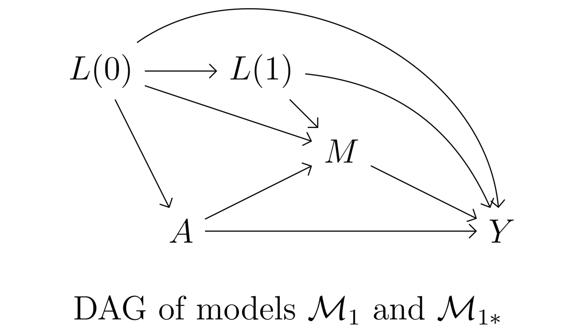
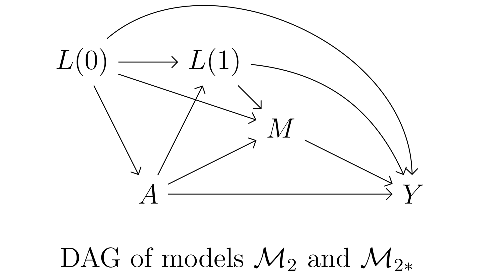

--- 
title: "Mediation Workshop"
author: "Benoît Lepage"
date: "`r Sys.Date()`"
site: bookdown::bookdown_site
# output: 
  # bookdown::gitbook: default
  # bookdown::pdf_book: default
documentclass: book
bibliography: [references_mediation_workshop.bib]
biblio-style: apalike
# url: your book url like https://bookdown.org/yihui/bookdown
# cover-image: path to the social sharing image like images/cover.jpg
description: "Expanse project - Mediation workshop. Online complementary document with practical examples in R."
link-citations: yes
github-repo: mediation_workshop
---

# Introduction

The objective of this document is to provide practical examples for the Expanse report [_"Mediation Analysis: a Starting Guide for Epidemiologists"_](https://github.com/benoitlepage/mediation_workshop/blob/main/Expanse%20report/Mediation_BL-2024-03-29.pdf) with R scripts corresponding to the different estimation methods presented in the report.

# Software 
The examples given in this workshop have been elaborated for R (version 4.2.2).

Depending on the estimator, some R packages might be necessary:

- COMPLETE ONCE ALL THE EXAMPLES ARE DONE

# Data sets
## General presentation of the data used in our examples
Four data sets have been simulated, each containing 7 variables:

- 2 baseline confounders (denoted $L(0)$ in the DAGs):
    - `L0_male`, a binary variable indicating the sex of the participant (1 for men, 0 for women);
    - `L0_parent_low_educ_lv`, a binary variable indicated if the parents of the participants had a low level of education (1 for a low educational level, 0 for a high educational level);
- 1 exposure of interest (denoted $A$ in the DAGs):
    - `A0_ace`, a binary variable indicating if the participants had been exposed to a high level of "Adverse childhood experience";
- 1 confounder of the mediator-outcome relationship (denoted $L(1)$ in the DAGs):
    - `L1`, a binary variable indicating if the participant has a low educational level (1 for a low educational level, 0 for a high educational level);
- 1 mediator of interest (denoted $M$ in the DAGs):
    - `M_smoking`, a binary variable indicating if the participant is a smoker (1 for smokers, 0 for non-smokers);
- 2 outcomes (denoted $Y$ in the DAGs):
    - `Y2_death`, a binary variable indicating the occurrence of death before 60 years of age (1 if dead, 0 if alive);
    - `Y2_qol`, a quantitative variable corresponding to a quality of life measurement.

## Data generating mechanisms
The 4 data generating mechanisms used to simulate the data sets are described in chapter 4 of the _Expanse "Mediation analysis" report_:

- The first two data sets are simulated from a causal model where confounders of the mediator-outcome relationship ($L(1)$) are not affected by the exposure $A$ (Figure \@ref(fig:figDAGM1)),
    - The data set [`df1.csv`](https://github.com/benoitlepage/mediation_workshop/blob/main/data/df1.csv) is simulated from the statistical model $\mathcal{M}_1$, which does not contain any $A \ast M$ interaction effect on the outcome $Y$.
    - The data set [`df1_int.csv`](https://github.com/benoitlepage/mediation_workshop/blob/main/data/df1_int.csv) is simulated from the statistical model $\mathcal{M}_{1 \ast}$, which contains an $A \ast M$ interaction effect on the outcome $Y$.

```{r figDAGM1, echo=FALSE, out.width="50%", fig.align="center", fig.cap="Causal model 1"}
    
```

- The next two data sets are simulated from a causal model where confounders of the mediator-outcome relationship ($L(1)$) are affected by the exposure $A$ (Figure \@ref(fig:figDAGM2)),
    - The data set [`df2.csv`](https://github.com/benoitlepage/mediation_workshop/blob/main/data/df2.csv) is simulated from the statistical model $\mathcal{M}_2$, which does not contain any $A \ast M$ interaction effect on the outcome $Y$.
    - The data set [`df2_int.csv`](https://github.com/benoitlepage/mediation_workshop/blob/main/data/df2_int.csv) is simulated from the statistical model $\mathcal{M}_{2 \ast}$, which contains an $A \ast M$ interaction effect on the outcome $Y$.
    
```{r figDAGM2, echo=FALSE, out.width="50%", fig.align="center", fig.cap="Causal model 2"}
    
```

The R functions used to simulate these 4 data sets are given in the Appendix A \@ref(appendix_a).

The Appendix B \@ref(appendix_b) describes how the true values for the estimands of the causal quantities of interest given in Table 2 of the _Expanse "Mediation analysis" report_ were calculated. Those true values are the theoretical values expected under the causal and statistical models $\mathcal{M}_1$, $\mathcal{M}_{1 \ast}$, $\mathcal{M}_2$ and $\mathcal{M}_{2 \ast}$. Estimations that will be obtained from the data sets `df1.csv`, `df1_int.csv`, `df2.csv`, and `df2_int.csv` will be slightly different from the true values because of sample variability.

